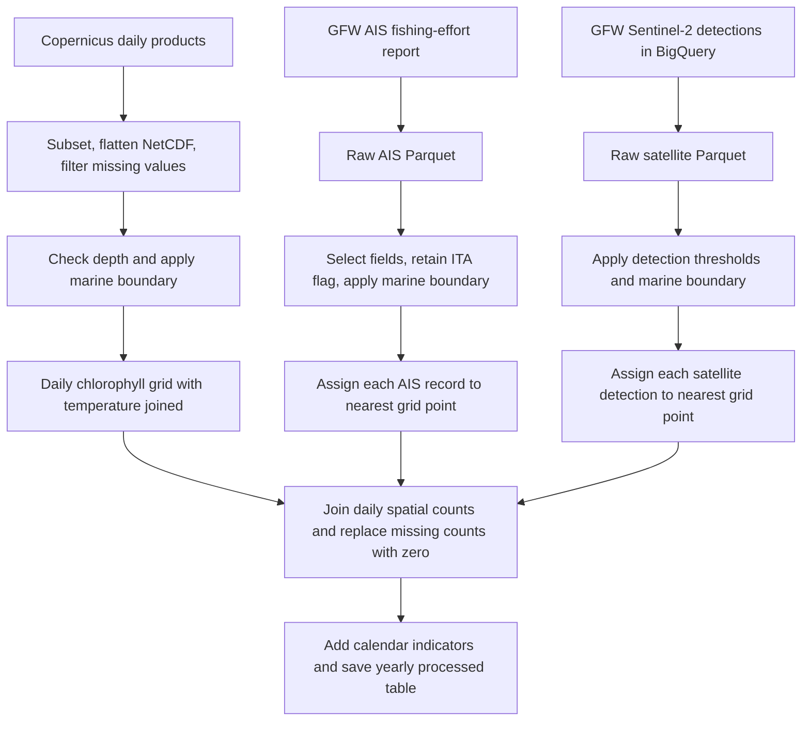

This document describes the AIPS data extraction, cleaning, and dataset construction workflow for the Gulf of Trieste. It is a technical reference for preparing the scientific manuscript, based on inspection of the executable pipeline and the local Parquet files on **1 October 2026**. The inspected repository commit was `83ea07412549917f1a727b36eb989853d2a69ced`. Implementation statements describe the current code; numerical inventories describe the files present at inspection. These are distinguished because the saved 2024 processed dataset is not fully reproducible from the current intermediate files.

The workflow combines daily marine environmental fields, AIS-derived apparent fishing activity, satellite vessel detections, and calendar indicators in a table indexed by date and spatial location. Its principal statistical unit is a **grid-location–day**. The vessel-related variables are counts of retained source records assigned to that location and day. They should not automatically be interpreted as numbers of distinct vessels, fishing hours, or complete observations of the fleet.

The authoritative implementation consists of [the extraction entry point](../scripts/01_get_data.py), [the cleaning entry point](../scripts/02_clean_data.py), [the dataset-building entry point](../scripts/03_build_dataset.py), and their supporting modules under `src/data`. The prototype notebooks document earlier development, but their contents and saved outputs are not interchangeable with the current scripts.

The three stages have the following responsibilities:

| Stage | Entry point | Inputs | Persisted result |
|---|---|---|---|
| Acquisition | `scripts/01_get_data.py` | Copernicus Marine, GFW FourWings, GFW data in BigQuery | Source-specific Parquet tables under `data/raw` |
| Cleaning | `scripts/02_clean_data.py` | Raw tables and the marine boundary CSV | Source-specific tables under `data/interim` |
| Integration | `scripts/03_build_dataset.py` | Four intermediate tables for one year | `data/processed/cpr_gfw_<year>.parquet` |



**The spatial and temporal domain is specified centrally.** All three entry points load [config/data.yaml](../config/data.yaml), using [config.py](../src/data/config.py) and [paths.py](../src/data/paths.py). Relative paths resolve against the repository root. The checked-in configuration selects 2024 and a requested interval from 1 January through 31 December. Both 2024 and 2025 files are present locally; producing each year requires selecting that year in the configuration or passing a correspondingly modified configuration dictionary to the functions. The entry points do not themselves loop over years or expose a command-line configuration argument.

| Extraction parameter | Configured value |
|---|---:|
| Minimum longitude | 13.141159647873394° E |
| Maximum longitude | 13.8238° E |
| Minimum latitude | 45.4698° N |
| Maximum latitude | 45.8078° N |
| Start month and day | 01-01 |
| End month and day | 12-31 |
| Minimum requested Copernicus depth | 0.0 m |
| Maximum requested Copernicus depth | 1.5 m |

For Copernicus, the request spans `YYYY-01-01T00:00:00` through `YYYY-12-31T23:59:59`. The satellite query uses those timestamp strings in inclusive SQL `BETWEEN` predicates. AIS acquisition passes the corresponding date strings to FourWings. The precise remote service interpretation of AIS interval endpoints is delegated to that API. Dataset construction subsequently uses the dates actually returned; it does not independently generate a complete calendar.

The configuration names two static files: `data/raw/italy_marine_bounds.csv` and `data/raw/ts_gulf_coords.csv`. The marine boundary file is used by all three cleaning modules. The Gulf coordinate file is referenced by notebooks and plotting configurations, but the production extraction–cleaning–integration chain does not use it to clip records to a Gulf polygon. Thus, the operational spatial selection is the configured bounding box followed by the implemented marine boundary test.

**Copernicus provides the environmental fields and the spatial support of the final table.** The active dataset identifiers, in their configured order, are:

| Position | Dataset identifier | Variable retained in the final table |
|---|---|---|
| 0 | `cmems_mod_med_phy-temp_my_4.2km_P1D-m` | `thetao` |
| 1 | `cmems_mod_med_bgc-plankton_my_4.2km_P1D-m` | `chl` |

These belong to the Mediterranean physical and biogeochemical reanalysis product families. They provide model-derived environmental estimates on a nominal 1/24° horizontal grid, conventionally described as approximately 4 km resolution. The project uses their daily products. They should be described as reanalysis fields, rather than direct local measurements collected by this project. See the official [physical product description](https://data.marine.copernicus.eu/product/MEDSEA_MULTIYEAR_PHY_006_004/description) and [biogeochemical product description](https://data.marine.copernicus.eu/product/MEDSEA_MULTIYEAR_BGC_006_008/description).

The final `thetao` variable is sea-water potential temperature in degrees Celsius. The final `chl` variable is chlorophyll-a mass concentration in mg m⁻³. These definitions and units are given in the [physical product user manual](https://documentation.marine.copernicus.eu/PUM/CMEMS-MED-PUM-006-004.pdf) and [biogeochemical product user manual](https://documentation.marine.copernicus.eu/PUM/CMEMS-MED-PUM-006-008.pdf). The pipeline performs no unit conversion.

In [copernicus.py](../src/data/copernicus.py), `download_copernicus_product` calls `copernicusmarine.subset` with the product identifier, bounding box, date interval, and depth limits. No explicit variable list is supplied. The returned NetCDF is opened with xarray and flattened with `to_dataframe().reset_index()`. The stored multiyear physical tables contain `bottomT` and `thetao`; the biogeochemical tables contain `chl` and `phyc`. Consequently, acquisition retains more environmental variables than the final model table uses.

The raw conversion removes rows with a missing value in the **last DataFrame column**, selected through `list(df.columns)[-1]`. In the inspected multiyear files those columns are `thetao` for physics and `phyc` for biogeochemistry. This is an implementation-dependent missing-value filter, not an explicit check of every marine variable or a dedicated land-mask operation. All values in the current raw multiyear tables were nonmissing, but the code alone does not guarantee that property for a different product schema.

The resulting raw file is `data/raw/copernicus/<product>_<year>.parquet`. With `remove_nc_after_conversion: true`, the temporary NetCDF is deleted. Therefore “raw” denotes the first stored tabular representation after spatial, temporal, and depth subsetting, flattening, and the missing-value filter. It is not an untouched copy of the provider's original data. NetCDF variable attributes, including the original unit metadata, are not explicitly preserved by this conversion.

During cleaning, an existing `depth` column must contain exactly one distinct nonmissing value; otherwise execution raises an error. That column is then removed, `time` is renamed `date`, and the marine boundary test is applied. In both inspected years, the retained depth is **1.0182366 m**. The environmental measurements should therefore be described as near-surface model values at approximately 1.02 m depth. The 0–1.5 m request does not produce a depth average. The cleaned files are saved as `data/interim/copernicus/cleaned_<product>_<year>.parquet` and retain all source environmental variables until integration selects `chl` and `thetao`.

**AIS extraction uses a GFW apparent fishing-effort report.** In [gfw_ais.py](../src/data/gfw_ais.py), the asynchronous request to `fourwings.create_report` uses the following settings:

| Request argument | Value |
|---|---|
| `datasets` | `["public-global-fishing-effort:latest"]` |
| `spatial_resolution` | `HIGH` |
| `temporal_resolution` | `DAILY` |
| `group_by` | `VESSEL_ID` |
| `spatial_aggregation` | `False` |
| `geojson` | Closed rectangular polygon built from the configured bounding box |

The returned report is converted to a DataFrame and written to `data/raw/gfw_ais/ais_high_daily_ts_<year>.parquet`. Authentication is read from the configured GFW token file. These are provider-processed activity records, not raw AIS position messages. GFW describes its apparent fishing-effort layer as an algorithmic interpretation of vessel movement; this distinction matters when characterizing the observations. See the [GFW user guide](https://globalfishingwatch.org/user-guide/).

The code passes the resolution label `HIGH`; it does not define a numerical AIS cell size. A precise angular resolution should therefore be attributed to the relevant API version if included in a manuscript, rather than inferred solely from that label. The requested grouping preserves vessel-level distinctions in the report, but a vessel may contribute records at several reported locations on the same day.

AIS cleaning drops selected metadata columns when present, renames `lat` and `lon` to `latitude` and `longitude`, and retains exactly eight fields: `date`, `latitude`, `longitude`, `gear_type`, `mmsi`, `ship_name`, `hours`, and `flag`. It then keeps records satisfying `flag == "ITA"` and applies the marine boundary filter. The nationality criterion is the reported flag code, not vessel location or inferred ownership.

The intermediate AIS output is `data/interim/gfw_ais/cleaned_ais_high_daily_ts_<year>.parquet`. Cleaning does not deduplicate records by MMSI, aggregate activity duration, impose a minimum `hours` threshold, or apply additional speed or length filters. The `hours` variable survives in the intermediate table but is not used in the final aggregation. The final response variable therefore measures record frequency, rather than accumulated fishing effort in hours.

**The satellite source is Sentinel-2 optical imagery despite the repository's “SAR” naming.** The table specified in the configuration and queried by [gfw_sar.py](../src/data/gfw_sar.py) is:

```text
global-fishing-watch.pipe_sentinel2_v1_published.detect_scene_match_pipe_v3
```

GFW identifies Sentinel-2 vessel detections as optical-imagery detections. Accordingly, this document calls them *Sentinel-2 detections* or *satellite detections*. The directory `gfw_sar`, function names containing `sar`, and final field `sar_vessels_count` are retained here only as literal software identifiers. Describing this configured source as synthetic-aperture radar would misidentify the observation system. See GFW's [Sentinel-2 optical imagery announcement](https://globalfishingwatch.org/platform-update/expanded-vessel-detections-with-sentinel-2-optical-imagery/).

The extraction creates a Google BigQuery client from the configured service-account key, uses that account's project with location `US`, and submits a parameterized query. The `WHERE` clause restricts detection timestamp, longitude, and latitude to the configured interval and bounding box. It selects these twelve columns:

```text
ssvid, detect_timestamp, detect_lat, detect_lon,
speed_kn_inferred, heading_deg_inferred, length_m_inferred,
presence_score, matching_score, cloud_score,
likely_infrastructure, date
```

The query applies no nationality filter, matching-score threshold, or vessel deduplication. It does not retrieve scene footprints or a daily coverage/exposure table. After download, `detect_timestamp` is converted to pandas datetime and the supplied `date` field to `YYYY-MM-DD` strings. The pipeline does not derive `date` anew from the timestamp. The output is `data/raw/gfw_sar/s2_vessel_detections_<year>.parquet`.

Satellite cleaning drops the precise detection timestamp, renames the coordinates, and retains only records satisfying **all five** of the following strict conditions:

| Attribute | Retention condition | Operational interpretation |
|---|---|---|
| `speed_kn_inferred` | `< 9` | Estimated speed below 9 knots |
| `length_m_inferred` | `< 25` | Estimated length below 25 m |
| `presence_score` | `> 0.5` | Presence score above the chosen threshold |
| `cloud_score` | `< 0.5` | Cloud score below the chosen threshold |
| `likely_infrastructure` | `== False` | Detection not flagged as likely infrastructure |

Threshold values are hard-coded in the cleaning function. Equality at any numerical threshold is excluded. Missing values in the comparison fields do not qualify as retained observations; in particular, missing cloud scores are excluded. The code imposes no lower bound on speed or length and does not establish that the retained detections are actively fishing. These filters define a selected group of relatively small, slow detections with the specified quality attributes, rather than a validated fishing-vessel classification.

The logged rejection count for each condition is evaluated against the same original input, so individual rejection counts overlap and should not be added together. The actual retained subset is the conjunction of all five masks. Afterward, `matching_score`, `cloud_score`, and `likely_infrastructure` are discarded, and the marine boundary test is applied. The intermediate file retains `date`, `latitude`, `longitude`, `ssvid`, `speed_kn_inferred`, `heading_deg_inferred`, `length_m_inferred`, and `presence_score`.

No condition requires an `ssvid` match, and there is no Italian-flag filter on this source. Of the saved intermediate detections, 1,865 of 2,604 in 2024 and 2,862 of 4,276 in 2025 have missing `ssvid`. Such records still contribute one count each. The satellite and AIS subsets therefore differ in selection criteria and identity coverage. The production pipeline does not reconcile identities between sources or compute a deduplicated union of them.

**Geographical cleaning uses a specific geometric rule shared by all sources.** In [geo.py](../src/data/geo.py), `filter_above_boundary` constructs a Shapely `LineString` by joining the five CSV coordinates in file order:

| Vertex | Longitude (° E) | Latitude (° N) |
|---|---:|---:|
| 1 | 13.72 | 45.60 |
| 2 | 13.63 | 45.63 |
| 3 | 13.39 | 45.57 |
| 4 | 13.31 | 45.55 |
| 5 | 13.21 | 45.45 |

For a point $p=(\lambda,\phi)$, the function finds the closest point $q(p)$ on that polyline using `line.project` and `line.interpolate`, then retains $p$ if

$$
\phi(p)>\phi(q(p)).
$$

These operations use planar longitude/latitude coordinates in degrees; the function performs no projection to a metric coordinate system. The condition compares the point's latitude with that of its nearest point on the line. It is not a polygon-containment test, and points on the line fail the strict inequality. Near line endpoints, the closest point may be an endpoint. Scientifically, the reproducible description is “retained points satisfying the implemented north-of-polyline criterion.” The CSV name alone does not establish the legal provenance or positional accuracy of an international maritime boundary.

**Integration takes its date–location support from chlorophyll availability.** In [build_dataset.py](../src/data/build_dataset.py), the builder reads the two Copernicus tables and the AIS and satellite intermediate tables. The Copernicus product order is significant: element 0 supplies physics and element 1 supplies biogeochemistry. The AIS and satellite intermediate filenames in this module are fixed to `cleaned_ais_high_daily_ts_<year>.parquet` and `cleaned_s2_vessel_detections_<year>.parquet`; changing the acquisition naming configuration alone does not update those assumptions.

All four `date` columns are passed through `pd.to_datetime`. This stage does not explicitly normalize times to midnight or convert them to local civil time. Successful joining relies on compatible daily values in the input tables, as observed in the inspected files. The timestamp is removed from satellite records during cleaning, so the final data cannot resolve within-day timing.

Let $K=(t,\phi,\lambda)$ denote the date–location key. The base key set is

$$
\mathcal{G}=\operatorname{unique}\{K:K\text{ occurs in the cleaned biogeochemical table}\}.
$$

The code first extracts these unique keys, then left-joins `chl` from the biogeochemical table and `thetao` from the physical table on exact date and coordinate equality. It performs no spatial interpolation between the environmental products and no temporal interpolation of missing values. A key missing from biogeochemistry never enters the base table; a base key lacking a physics match receives missing `thetao`.

Although the initial key list is deduplicated, the environmental tables joined back to it are not validated for key uniqueness. Duplicate environmental records could therefore multiply rows. The actual multiyear inputs inspected here have the expected unique keys, and the resulting yearly datasets contain one row per key. Complete daily coverage is an empirical property of these inputs, rather than a guarantee enforced by a calendar expansion or reindexing step.

**Vessel records are assigned to their nearest retained environmental grid point.** The function `project_vessels_to_copernicus_grid` first extracts unique source coordinate pairs and unique target grid coordinates. It computes one nearest-point assignment per distinct source location and merges that assignment back onto every source row. The preliminary coordinate deduplication reduces repeated distance calculations; it does not remove vessel records.

Nearest neighbours are obtained using a scikit-learn `BallTree` with the haversine metric on latitude–longitude pairs converted to radians. A NumPy haversine calculation provides a fallback. With angular coordinates in radians and Earth radius $R=6{,}371{,}000$ m, the distance is

$$
a=\sin^2\!\left(\frac{\phi_2-\phi_1}{2}\right)
 +\cos\phi_1\cos\phi_2\sin^2\!\left(\frac{\lambda_2-\lambda_1}{2}\right),
\qquad
d=2R\operatorname{atan2}(\sqrt a,\sqrt{1-a}).
$$

For a source position $p$, the assigned grid location is

$$
\pi(p)=\underset{s\in\mathcal S}{\operatorname{argmin}}\;d(p,s),
$$

where $\mathcal S$ is the union of spatial locations in the base environmental table. Assignment is independent of date. Original vessel coordinates are replaced by the chosen grid coordinates. The builder requests no distance column and imposes no maximum assignment distance. This is nearest-centre allocation, not an intersection with explicitly constructed cell polygons. The final file contains neither cell boundaries nor cell areas, and no coastline-aware routing or sea-only distance is calculated.

A diagnostic calculation on the saved intermediate records found the following assignment distances. Values are weighted by source rows, including repeated locations, and rounded to the nearest metre. They are audit results, not fields retained by the pipeline.

| Source and year | Median distance (m) | 95th percentile (m) | Maximum (m) |
|---|---:|---:|---:|
| AIS 2024 | 1,686 | 2,884 | 8,099 |
| AIS 2025 | 1,685 | 2,715 | 8,165 |
| Sentinel-2 2024 | 2,193 | 5,067 | 8,043 |
| Sentinel-2 2025 | 2,148 | 4,956 | 8,990 |

These maxima demonstrate why nominal environmental resolution should not be interpreted as an upper bound on assignment distance. Boundary filtering and coastal coverage can leave a source point several kilometres from the nearest retained target.

**Daily spatial counts are sums of records, with source-specific meanings.** Let $A$ and $S$ be the cleaned AIS and satellite record collections. For date $t$, grid location $s$, and AIS gear category $g$, the implemented aggregations are

$$
Y^{\mathrm{AIS}}_{s,t}
=\sum_{r\in A}\mathbf{1}\{t_r=t,\;\pi(p_r)=s\},
$$

$$
Y^{\mathrm{S2}}_{s,t}
=\sum_{r\in S}\mathbf{1}\{t_r=t,\;\pi(p_r)=s\},
\qquad
Y^{(g)}_{s,t}
=\sum_{r\in A}\mathbf{1}\{t_r=t,\;\pi(p_r)=s,\;g_r=g\}.
$$

Both total counts use pandas `groupby(...).size()`. AIS gear counts additionally group by `gear_type` with `dropna=False` and pivot categories into columns. Gear columns are generated from the observed categories and sorted alphabetically in the output. The literal category `NA` present in 2025 is a string-valued gear label in those data, not a missing numerical count.

Each retained row contributes one regardless of fishing duration, identity, inferred length, or confidence score. There is no `nunique(mmsi)` or `nunique(ssvid)` operation. For example, if one vessel contributes three AIS report rows that all map to the same location and day, the implemented count is three. Among the saved 2024 AIS intermediate records, 4,005 rows correspond to 2,436 distinct `(date, assigned location, mmsi)` combinations and 666 distinct `(date, mmsi)` combinations. In 2025 the corresponding numbers are 4,818, 2,794, and 691. There are 15 distinct MMSIs in the 2024 intermediate file and 16 in 2025. These diagnostics show that row counts and distinct-vessel counts differ materially.

Satellite counts likewise represent detections. Because the query does not select a detection identifier or enforce identity-based uniqueness, the pipeline provides no guarantee of one count per physical vessel per day. AIS and satellite counts remain separate columns; they are not summed into a combined fleet count. The intermediate populations also have different filters: Italian-flag apparent fishing records for AIS, and size/speed/quality-selected detections for Sentinel-2.

After aggregation, satellite counts and then AIS totals and gear counts are left-joined to the environmental grid. Unmatched count values are replaced with zero. Current code casts total and gear counts to integer types. It leaves `chl` and `thetao` unchanged and does not impute missing environmental values. No row is removed because it has zero AIS or zero satellite activity.

Thus a zero means **no retained record was joined to this date–location key**. For AIS it can reflect absence of reported apparent fishing activity under the selection criteria; the pipeline does not establish complete fleet observability. For Sentinel-2, an absent observation, an unobserved location, or a rejected detection can also result in zero. Without scene coverage or exposure data, the processed table cannot distinguish a surveyed cell with no detections from a cell without usable imagery. The code does not estimate detection probabilities or correct either count for observation effort.

Because the merge is left-sided, source records assigned to a location that lacks a base key on their date would disappear from the integrated table. In the inspected intermediate datasets, full daily environmental coverage allows all records to contribute when the current builder is reconstructed: total satellite counts equal intermediate satellite row counts in both years, and reconstructed AIS totals equal intermediate AIS row counts. The stored 2024 final AIS total is different, as detailed below.

**Calendar indicators are appended without modifying the observed counts.** `add_calendar_features` uses `holidays.country_holidays("IT", years=year)` and pandas weekday values:

| Output field | Implemented definition |
|---|---|
| `is_holiday` | Date belongs to the Italian holiday set returned by the installed `holidays` package |
| `holiday_name` | Package-supplied name for that date; otherwise missing |
| `is_weekend` | Weekday number is at least 5, meaning Saturday or Sunday |
| `fishing_block` | Initially false; set true for 31 July–13 September inclusive only when `year == 2024` |

The 2024 block spans 45 days. Every 2025 row has `fishing_block == False`, because no interval is coded for that year. This indicates the scope of the implemented annotation; it does not establish that fishing restrictions were absent in 2025. The function supplies no legal citation or gear-specific applicability rule for the 2024 dates, so they should be reported as a manually specified calendar covariate unless separately substantiated. Counts are retained during the marked interval and on holidays and weekends.

The installed calendar mapping marks 13 dates in each saved year. It includes entries named `National Unity Day` on 3 November 2024 and 2 November 2025. The precise implemented feature is therefore membership in the package-returned calendar, not a separately verified indicator that all fishing operations were legally prohibited or that every marked date was a nonworking day. Both years contain 104 weekend days; holiday and weekend indicators may overlap.

**The processed schema preserves physical units and separate observation channels.** `reorder_columns` writes the fixed columns below followed by the alphabetically ordered gear categories. Output uses Parquet with `index=False`.

| Column | Meaning | Representation produced by the current builder |
|---|---|---|
| `date` | Daily key supplied by the environmental grid | pandas datetime |
| `is_holiday` | Membership in package-defined Italian holiday calendar | Boolean |
| `holiday_name` | Calendar label, missing on other dates | Text/null |
| `is_weekend` | Saturday or Sunday | Boolean |
| `fishing_block` | Manually specified 2024 interval | Boolean |
| `latitude` | Assigned environmental grid latitude | Degrees north |
| `longitude` | Assigned environmental grid longitude | Degrees east |
| `chl` | Near-surface daily chlorophyll-a concentration | mg m⁻³ |
| `thetao` | Near-surface daily potential temperature | °C |
| `sar_vessels_count` | Number of retained Sentinel-2 detection rows | Nonnegative integer count |
| `ais_vessels_count` | Number of retained AIS report rows | Nonnegative integer count |
| One column per observed gear label | Number of retained AIS rows of that category | Nonnegative integer count |

The output is an interpretable spatial panel. Dataset construction performs no normalization, logarithmic transformation, temporal lag creation, train/test split, or area/exposure normalization. In particular, counts are not densities per square kilometre. Coordinates identify retained grid centres; the builder does not assign a separate numeric cell identifier.

**The local data inventory establishes actual coverage and attrition.** The table below describes the active multiyear source files, excluding `from_notebooks` copies and inactive analysis/forecast products. “Raw” has the qualified meaning given above. Intermediate counts are measured from saved files, rather than inferred from the code.

| Source | 2024 raw rows | 2024 intermediate rows | 2025 raw rows | 2025 intermediate rows |
|---|---:|---:|---:|---:|
| Copernicus physical multiyear | 27,084 | 17,934 | 27,010 | 17,885 |
| Copernicus biogeochemical multiyear | 27,084 | 17,934 | 27,010 | 17,885 |
| GFW AIS | 8,290 | 4,005 | 7,722 | 4,818 |
| GFW Sentinel-2 | 12,397 | 2,604 | 20,627 | 4,276 |

Each raw multiyear environmental file contains 74 unique coordinate pairs. Boundary filtering retains 49, consistently on all 366 days of 2024 and all 365 days of 2025. These locations span approximately 45.479168–45.729168° N and 13.166667–13.708333° E. There are seven distinct latitude values and fourteen longitude values, but only 49 retained coordinate pairs: the spatial support is an irregular subset of a regular grid, not the full 7 × 14 rectangle. The saved yearly processed tables use the same set of 49 locations.

For satellite cleaning, recomputing the five-threshold conjunction retains 4,079 rows in 2024 and 6,565 in 2025 before the boundary filter. The boundary criterion reduces these to 2,604 and 4,276. These selected records match the saved satellite intermediate values after disregarding row ordering and dtype representation. Both years' environmental intermediate files also match cleaning of their current raw multiyear inputs.

For AIS, the 2025 raw table contains 4,908 Italian-flag rows, of which 4,818 pass the boundary test and match the saved intermediate file. In 2024, the corresponding recomputation gives 4,186 Italian-flag rows and **4,051** rows after the boundary test, whereas the saved intermediate file contains **4,005**. Consequently, the 2024 raw and intermediate AIS files cannot be treated as a verified, internally consistent execution of the present cleaning procedure.

Temporal coverage of record-based sources is sparse even when an entire year is requested:

| Saved intermediate source | 2024 first–last record | 2024 distinct dates | 2025 first–last record | 2025 distinct dates |
|---|---|---:|---|---:|
| AIS | 2 January–30 December | 247 | 2 January–30 December | 255 |
| Sentinel-2 | 5 January–30 December | 86 | 4 January–30 December | 107 |

The final table nevertheless has rows on every day because environmental support supplies those dates and unmatched counts are filled with zero. A source's distinct record dates measure days with retained records; they do not measure all days on which the source could have observed the study area.

The saved processed files have the following properties:

| Property | `cpr_gfw_2024.parquet` | `cpr_gfw_2025.parquet` |
|---|---:|---:|
| Date range | 1 January–31 December 2024 | 1 January–31 December 2025 |
| Distinct days | 366 | 365 |
| Locations per day | 49 | 49 |
| Rows | 17,934 | 17,885 |
| Columns | 16 | 15 |
| Duplicate date–location keys | 0 | 0 |
| Sum of stored AIS counts | 4,035 | 4,818 |
| Sum of stored satellite counts | 2,604 | 4,276 |
| Rows with positive AIS count | 1,662 | 1,923 |
| Rows with positive satellite count | 885 | 1,286 |
| Dates with positive AIS total | 242 | 255 |
| Dates with positive satellite total | 86 | 107 |
| Dates marked `fishing_block` | 45 | 0 |

Neither processed file contains missing values in coordinates, environmental variables, counts, or Boolean features. `holiday_name` is missing on nonholiday dates, as intended. In both files, the gear-category counts sum to `ais_vessels_count` on every row. The stored 2024 count columns use `float64`, although all values are nonnegative and integer-valued; the 2025 count columns use `int64`, matching the current builder's casts. Both saved files use `float32` for coordinates and environmental fields.

The gear categories differ between years. The table also shows what the current builder obtains from the saved 2024 intermediate AIS file:

| Gear category | Saved 2024 final total | Reconstructed 2024 total | Saved/reconstructed 2025 total |
|---|---:|---:|---:|
| `DREDGE_FISHING` | 57 | 56 | 23 |
| `FISHING` | 5 | 53 | 74 |
| `OTHER_PURSE_SEINES` | 38 | 40 | Column absent |
| `POTS_AND_TRAPS` | 79 | 84 | Column absent |
| `TRAWLERS` | 3,856 | 3,772 | 4,660 |
| `NA` | Column absent | Column absent | 61 |
| **All categories** | **4,035** | **4,005** | **4,818** |

**Reconstruction identifies a material provenance gap for 2024.** For this inspection, the current builder functions were run in memory from the saved intermediate tables; reconstructed values were aligned to saved output using `(date, latitude, longitude)`. No downloaded, intermediate, or processed data file was overwritten. The 2025 reconstruction matched every saved column value after alignment. For 2024, the key set and column set matched, but values differed as follows:

| 2024 field or component | Reconstruction compared with stored final file |
|---|---|
| Environmental `chl` | Different at all 17,934 date–location keys |
| Environmental `thetao` | Different at all 17,934 date–location keys |
| `ais_vessels_count` | Different at 1,166 keys; total 4,005 reconstructed versus 4,035 stored |
| Gear-category counts | Differences in all five categories, as summarized above |
| `sar_vessels_count` | Same values |
| Calendar fields | Same values |

The discrepancies are not explained by row ordering. Together with the raw-to-intermediate AIS mismatch, they demonstrate that the available 2024 artifacts do not form one verified chain under the inspected implementation. The present inspection does not establish whether this resulted from different downloads, earlier processing, manual replacement, or another cause. A scientific account should not claim byte-for-byte or value-level reproducibility for that year until its artifact lineage is reconciled. The saved 2024 inventory above remains a description of the file currently on disk, while the formulas describe the current code.

The repository also contains earlier Copernicus analysis/forecast files using `cmems_mod_med_phy-tem_anfc_4.2km_P1D-m` and `cmems_mod_med_bgc-pft_anfc_4.2km_P1D-m`, currently commented out in `config/data.yaml`. Their local 2024 intermediate coverage starts on 30 March for physics and 26 February for biogeochemistry, respectively. They should not be used to infer the coverage of the active full-year multiyear inputs or silently combined with them. Files under `from_notebooks` likewise belong to separate artifact histories. The prototype integration notebook includes an identity-overlap check between satellite `ssvid` and AIS `mmsi`; the current production builder does not include that check, so it is not evidence of disjoint sources in the present workflow.

**Multiple years and model-specific transformations are handled after dataset construction.** [multi_year.py](../src/data/multi_year.py) resolves a base path such as `data/processed/cpr_gfw.parquet` into year-specific files and concatenates them when `years: [2024, 2025]` is selected. With the saved files, this yields 35,819 date–location rows across 731 days. The helper does not harmonize absent gear columns or fill their missing values after concatenation. Because the two files have different gear categories, the combined DataFrame has the union of columns, with missing values for categories absent from a yearly schema. This requires attention if those category columns are selected as model inputs.

The LGCP preparation code in [data_pp_lgcp.py](../src/models/data_pp_lgcp.py) adds Gulf-level daily chlorophyll summaries, optionally creates observed-past count lags and rolling averages, constructs temporal coordinates, splits by day, and fits coordinate/time/covariate standardization on training rows only. Its usual count target is `ais_vessels_count`. These operations occur after loading and are not columns or transformations persisted by `03_build_dataset.py`. Daily chlorophyll summaries include the unweighted spatial mean, its first difference, and 7- and 14-day shifted values; initial missing lag values are backfilled and then forward-filled. Count lag features use shifts, rolling averages after a one-row shift, and a configured initial fill value. Interpreting such shifts as calendar-day lags relies on consecutive daily inputs, which the audited panel supplies.

Model evaluation needs its own information-availability assumptions: retrospective reanalysis values on a test date and observed count lags are not made available at a forecast origin merely by being present in this dataset. The data-building scripts do not implement a forecast-vintage archive or a rule governing multi-day prediction availability.

**Reproduction depends on both execution settings and preserved artifacts.** From the repository root, the intended stage order is:

```bash
python scripts/01_get_data.py
python scripts/02_clean_data.py
python scripts/03_build_dataset.py
```

These commands are operational instructions, not actions performed during this documentation task. The checked-in configuration enables overwriting for downloads, cleaned files, and processed output. With overwrite disabled, the corresponding function reuses an existing file based on its path, without comparing the file's provenance to current configuration values. Filenames encode source/product and year but not the bounding box, threshold choices, date subinterval, or acquisition revision. The AIS selector additionally uses `:latest`; the Copernicus call supplies no explicit dataset version. Re-executing a request at a later date therefore need not return identical remote content.

For a reproducible experiment, the necessary provenance includes the exact code revision, configuration, static coordinate files, dependency environment, source versions or acquisition dates, and the precise raw/intermediate/processed artifacts used. The repository contains pinned dependencies in [requirements.txt](../requirements.txt), but the pipeline itself does not write a run manifest, input checksums, API response metadata, or a complete transformation log alongside the datasets. It also removes the original Copernicus NetCDF by default. These are limits of the existing provenance record, not procedures already implemented.

The inspection underlying this document checked file schemas, date ranges, unique spatial locations, missing values, duplicate processed keys, daily panel completeness, gear-count reconciliation, source-count totals, raw-to-intermediate cleaning results, and reconstruction from intermediate tables. The core final-stage comparison can be repeated without calling download functions or writing datasets:

```python
import pandas as pd
from src.data.config import load_config
from src.data.build_dataset import (
    read_interim_datasets, standardize_dates, build_copernicus_grid,
    add_sar_counts, add_ais_counts, add_calendar_features, reorder_columns,
)

config = load_config()
keys = ["date", "latitude", "longitude"]
for year in [2024, 2025]:
    config["year"] = year
    bgc, phy, ais, satellite = standardize_dates(*read_interim_datasets(config))
    reconstructed = build_copernicus_grid(bgc, phy)
    reconstructed = add_sar_counts(reconstructed, satellite)
    reconstructed = add_ais_counts(reconstructed, ais)
    reconstructed = reorder_columns(add_calendar_features(reconstructed, config))
    saved = pd.read_parquet(f"data/processed/cpr_gfw_{year}.parquet")

    assert not reconstructed.duplicated(keys).any()
    assert not saved.duplicated(keys).any()
    left = reconstructed.set_index(keys).sort_index()
    right = saved.set_index(keys).sort_index()
    assert left.index.equals(right.index)
    assert set(left.columns) == set(right.columns)
    for column in left.columns:
        equal = left[column].eq(right[column]) | (
            left[column].isna() & right[column].isna()
        )
        differences = int((~equal).sum())
        if differences:
            print(year, column, differences)
```

For manuscript drafting, the supported description is a daily, near-surface environmental panel enriched with counts of Italian-flag AIS apparent-fishing report records and independently filtered Sentinel-2 optical detections, assigned by haversine nearest-neighbour matching to 49 retained Copernicus grid locations. The count definitions, zero-filling convention, spatial selection rule, year-specific calendar annotation, and unresolved 2024 provenance differences are part of that method and should remain explicit wherever they affect interpretation.
