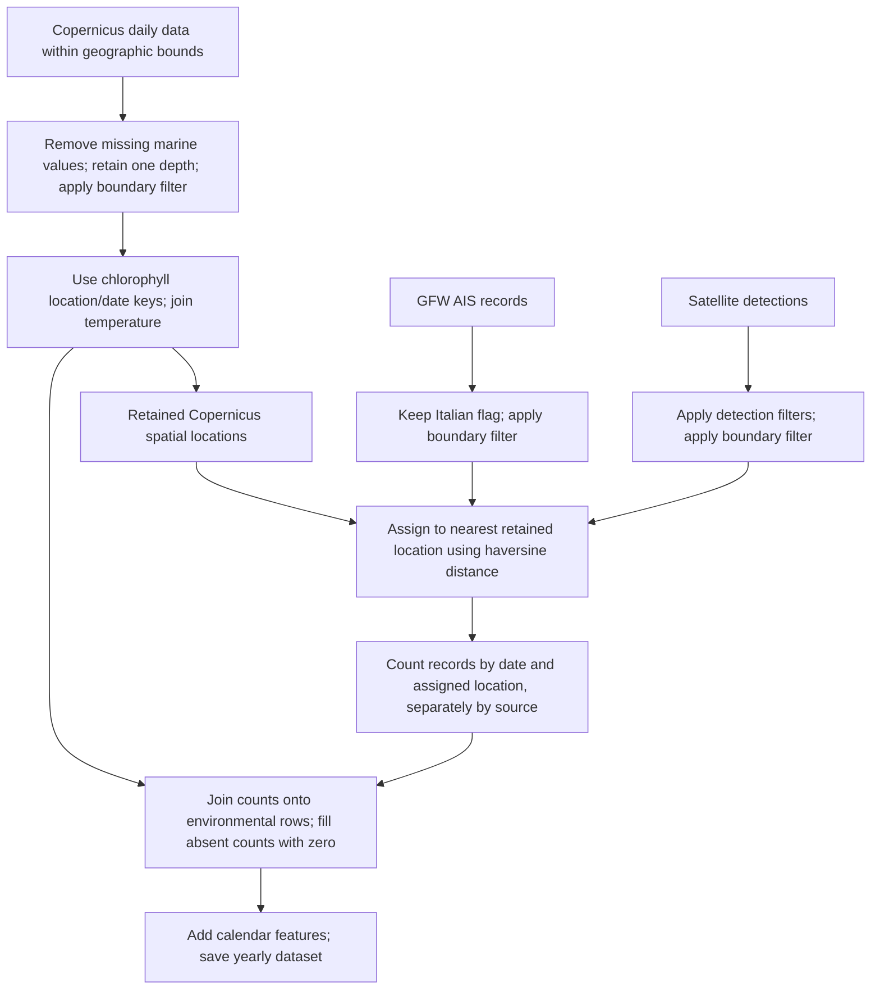

# Model description: technical working notes

These notes describe the implementation and local data inspected on 30 September 2026. They are supporting material for writing the paper, rather than proposed paper prose. Code references identify the implementation; numerical observations identify the saved files examined. Explanations of possible motivation are explicitly distinguished from behavior verified in code.

The chapters follow the data construction, prediction task, proposed model, comparison models, and inference details:

- [Discretization of the Gulf](#discretization-of-the-gulf-and-alignment-of-vessel-and-copernicus-data)
- [Prediction cell and evaluation setting](#prediction-cell-and-evaluation-setting)
- [LGCP](#lgcp), including the [kernel](#kernel)
- [LGCP+classifier](#lgcpclassifier)
- [Last available Poisson: one step ahead](#last-available-poisson-one-step-ahead)
- [Global cell mean: expanding](#global-cell-mean-expanding)
- [Window-GLM](#window-glm)
- [GNN](#gnn)
- [ConvLSTM](#convlstm)
- [Sparse variational inference](#sparse-variational-inference)

# Discretization of the Gulf and alignment of vessel and Copernicus data

## What the discretization actually produces

The common spatial reference is the set of retained **Copernicus grid locations**. Vessel locations are assigned to the nearest of these locations, and vessel records are counted separately for each location and date. Chlorophyll and temperature are attached to the same location/date keys. Consequently, one dataset row represents one retained spatial location on one day.

The saved 2024 and 2025 datasets both contain **49 spatial locations**, with the same coordinates in both years. Each day contains all 49 locations, including locations with zero vessel records. The spatial coordinates lie on a regular longitude–latitude lattice, but only a subset of the lattice positions is retained. There are 14 distinct longitudes and 7 distinct latitudes; the dataset contains 49 of their 98 possible combinations.

The implementation stores point coordinates, not cell polygons or cell areas. “Grid cell” is the convenient name for a location and the vessel records assigned to it. More precisely, the assignment defines an implicit nearest-centre partition of the vessel observation domain. There is no explicit construction or storage of those partition boundaries.

The main implementation is [build_dataset.py:96](../../src/data/build_dataset.py#L96), with spatial assignment in [geo.py:60](../../src/data/geo.py#L60).

## Geographic extent and the boundary filter

The acquisition rectangle is specified in [config/data.yaml:3](../../config/data.yaml#L3):

| Coordinate | Minimum | Maximum |
| --- | ---: | ---: |
| Longitude | 13.141159647873394° | 13.8238° |
| Latitude | 45.4698° | 45.8078° |

This rectangle is passed to the Copernicus subset request, the AIS report request as a GeoJSON polygon, and the satellite query as longitude/latitude bounds. See [copernicus.py:70](../../src/data/copernicus.py#L70), [gfw_ais.py:60](../../src/data/gfw_ais.py#L60), and [gfw_sar.py:72](../../src/data/gfw_sar.py#L72).

A second spatial restriction is applied during cleaning to all three sources. The file [italy_marine_bounds.csv](../../data/raw/italy_marine_bounds.csv) supplies these vertices, connected in file order:

| Longitude | Latitude |
| ---: | ---: |
| 13.72 | 45.60 |
| 13.63 | 45.63 |
| 13.39 | 45.57 |
| 13.31 | 45.55 |
| 13.21 | 45.45 |

The function `filter_above_boundary` constructs a Shapely `LineString` from them. For each observation point, it finds the nearest point on that line and retains the observation only when its latitude is strictly greater than the latitude of the projected point. Equality is excluded. This geometric projection uses the longitude/latitude coordinates directly, with no conversion to a metric coordinate reference system. See [geo.py:31](../../src/data/geo.py#L31).

Thus the operational selection is “above the supplied polyline” according to that test. The code does not perform membership testing in an official maritime polygon, compute clipped coastal cell areas, or independently establish the legal meaning of the supplied boundary. Calling it an exact territorial-water mask would go beyond the implementation.

A different file, [ts_gulf_coords.csv](../../data/raw/ts_gulf_coords.csv), is used to draw and mask the displayed Gulf maps. It is not read by the current data cleaning or grid-building functions. For example, [viz_lgcp.py:188](../../src/visualization/viz_lgcp.py#L188) loads it, and [viz_lgcp.py:231](../../src/visualization/viz_lgcp.py#L231) masks an interpolated display surface with it. The displayed polygon and the selection used to build the observations therefore have distinct roles.

## Copernicus inputs, depth, and retained spatial resolution

The current preparation configuration selects the following products in this order:

| Role | Product identifier | Variable used in the final dataset |
| --- | --- | --- |
| Physical | `cmems_mod_med_phy-temp_my_4.2km_P1D-m` | `thetao`, temperature |
| Biogeochemical | `cmems_mod_med_bgc-plankton_my_4.2km_P1D-m` | `chl`, chlorophyll |

These are the values in [config/data.yaml:25](../../config/data.yaml#L25). The builder assumes that product index 0 is the physical product and index 1 the biogeochemical product; it does not discover those roles from metadata ([build_dataset.py:23](../../src/data/build_dataset.py#L23)). The alternative `phy-tem_anfc` and `bgc-pft_anfc` identifiers are present as comments in the configuration and are used in the original notebooks. Their relevance to the saved 2024 data is documented under [Verification and data provenance](#verification-and-data-provenance).

The download requests depths between 0 and 1.5 m. In the inspected current raw `*_my_*` files for both years, the only depth is approximately **1.01824 m**. Cleaning requires exactly one non-missing depth value when a `depth` column exists, then drops that column. There is no averaging or integration over the depth interval. See [copernicus.py:206](../../src/data/copernicus.py#L206).

During conversion from NetCDF to a DataFrame, rows with a missing marine variable are removed. Technically, the variable used for this filter is the last DataFrame column (`list(df.columns)[-1]`); it is not selected by the name `chl` or `thetao`. This is an implementation assumption relevant if products change ([copernicus.py:83](../../src/data/copernicus.py#L83)). No separate coastline mask is applied here: retention follows the downloaded non-missing values and the subsequent boundary test.

For each currently configured raw product, the local files contain 74 unique non-missing spatial locations; cleaning leaves 49. The saved processed grids have the following properties:

| Property | Verified value |
| --- | --- |
| Retained spatial locations | 49 in both years |
| Distinct longitudes × distinct latitudes | 14 × 7 |
| Nominal angular step on each axis | 1/24° ≈ 0.0416667° = 2.5 arcminutes |
| Retained longitude range | Approximately 13.166667°–13.708333° |
| Retained latitude range | Approximately 45.479168°–45.729168° |
| Approximate north–south spacing | 4.63 km |
| Approximate east–west spacing at latitude 45.6° | 3.24 km |

The kilometre values are calculations from the angular spacing using a spherical Earth radius of 6,371 km, consistent with the distance helper. Small variations in coordinate differences arise from stored floating-point precision. The `4.2km` text is part of the product identifier; the inspected grid should not be described as exactly 4.2 km × 4.2 km equal-area squares. Likewise, the `0.5'` description in the opening comment of [gnn.py](../../src/models/gnn.py) does not match the processed coordinate spacing.

No cell area or coastal water fraction is computed. The model grid resolution is inherited from the selected Copernicus data; there is no independent `cell_size` parameter in the preparation configuration.

## Construction of the daily environmental table

`build_copernicus_grid` starts from the distinct `(date, latitude, longitude)` keys present in the cleaned biogeochemical data. It attaches `chl` from that dataset and `thetao` from the physical dataset using exact-key left joins. See [build_dataset.py:96](../../src/data/build_dataset.py#L96).

This has several consequences:

- The biogeochemical data determine which space–time rows exist. Additional physical-product locations or dates do not enlarge the table.
- Temperature must match the exact date and coordinate values. No environmental spatial interpolation, nearest-neighbour matching, or temporal interpolation is performed between products.
- The code does not construct the Cartesian product of all dates and all locations. A complete daily panel is a verified property of the present data, rather than a guarantee supplied by an explicit reindexing step.
- Missing temperature after the join remains missing. Environmental missing values are not filled with zero by the count-filling operations.
- Although the initial key table is deduplicated, the attached environmental tables are not deduplicated or checked with a one-to-one merge constraint. Multiple source rows for a key could multiply output rows. The inspected current datasets have no duplicate final keys.

Time is inherited from the daily products and AIS report configuration. The builder applies `pd.to_datetime` to all date columns; it does not floor arbitrary timestamps to days or resample subdaily data. The inspected interim dates are all at midnight. Satellite cleaning discards `detect_timestamp` and retains the source `date` column. See [build_dataset.py:74](../../src/data/build_dataset.py#L74) and [gfw_sar.py:228](../../src/data/gfw_sar.py#L228).

## Vessel data retained before assignment

**AIS.** The configured source is `public-global-fishing-effort:latest`, requested with `spatial_resolution: HIGH`, `temporal_resolution: DAILY`, `group_by: VESSEL_ID`, and `spatial_aggregation=False`. These are GFW report records; the local code does not start from raw AIS transmission messages or reconstruct trajectories. The precise external definition of `HIGH` is not encoded in this repository, so no unverified kilometre value is assigned to it here. See [gfw_ais.py:73](../../src/data/gfw_ais.py#L73).

Cleaning retains only `flag == "ITA"`, applies the boundary filter, and keeps date, coordinates, gear type, MMSI, ship name, hours, and flag. The identifier column `vessel_id` is dropped, while `mmsi` remains. The builder subsequently counts rows and does not use `hours` as a weight. See [gfw_ais.py:173](../../src/data/gfw_ais.py#L173).

**Satellite detections.** The code names this stream `gfw_sar` and its output `sar_vessels_count`, but the configured table is `global-fishing-watch.pipe_sentinel2_v1_published.detect_scene_match_pipe_v3`, and filenames begin with `s2_vessel_detections`. The repository naming is therefore inconsistent; the `sar` variable name alone is insufficient evidence for describing the sensor as SAR in the paper. These notes use “satellite detections” without attempting to resolve external sensor metadata.

The following conditions must all hold:

| Field | Required condition |
| --- | --- |
| `speed_kn_inferred` | < 9 |
| `length_m_inferred` | < 25 |
| `presence_score` | > 0.5 |
| `cloud_score` | < 0.5 |
| `likely_infrastructure` | False |

These thresholds are hard-coded, not YAML parameters. `matching_score` is retrieved but is not used as a filter. No Italian-flag restriction analogous to the AIS restriction is applied to this stream. Both streams undergo the same boundary test. See [gfw_sar.py:258](../../src/data/gfw_sar.py#L258).

## Nearest-location assignment

For each vessel source independently, the builder extracts distinct original coordinates and distinct target Copernicus coordinates. Each source coordinate is mapped once; that lookup is joined back onto every vessel record at that coordinate. The original coordinates are then replaced by the assigned Copernicus coordinates. Deduplicating coordinates at this stage saves repeated distance calculations; it does not deduplicate vessel records. See [build_dataset.py:127](../../src/data/build_dataset.py#L127).

Let the retained locations be \(S=\{s_1,\ldots,s_m\}\), with \(m=49\) for the inspected files. For a source location \(p\), its assigned index is

\[
j^*(p)=\operatorname*{arg\,min}_{1\leq j\leq m}d_H(p,s_j),
\]

where \(d_H\) is the spherical haversine distance. With latitude \(\phi\) and longitude \(\lambda\) in radians,

\[
a=\sin^2\!\left(\frac{\phi_2-\phi_1}{2}\right)
 +\cos\phi_1\cos\phi_2\sin^2\!\left(\frac{\lambda_2-\lambda_1}{2}\right),
\qquad
d_H=2R\operatorname{atan2}(\sqrt a,\sqrt{1-a}),
\]

with \(R=6{,}371{,}000\) m. The fast implementation uses `BallTree(metric="haversine")` and `k=1`; the fallback computes the same distance with NumPy. See [geo.py:80](../../src/data/geo.py#L80).

The assignment has one destination per record, with no fractional weights or smoothing. It uses the union of spatial locations in the environmental table across all dates, independently of vessel date. It imposes no maximum assignment distance, coastline barrier, or requirement that a vessel lie within a predefined rectangular footprint around its destination. Ties have no explicit scientific tie-breaking rule in the code; the search implementation resolves them.

An interpretation of this rule is a Voronoi-like partition restricted to the already-filtered vessel domain. Near omitted grid points, coastlines, or the edge of the retained region, the effective catchment of a retained location can extend beyond the footprint suggested by the regular lattice spacing. For example, in the current 2025 interim data, the maximum assignment distance is approximately 8.16 km for AIS locations and 8.99 km for satellite locations. These values were measured from the existing files; no distance cutoff is applied.

## Daily counts and the meaning of a zero

For retained AIS records \(r\), with source location \(p_r\) and date \(t_r\), the implemented count is

\[
y^{\mathrm{AIS}}_{j,t}
=\sum_{r\in\mathcal R_{\mathrm{AIS}}}
\mathbf 1\{j^*(p_r)=j\}\,\mathbf 1\{t_r=t\}.
\]

The satellite count is constructed by the same formula over the filtered satellite records. The implementation is `groupby(["date", "latitude", "longitude"]).size()`. AIS records are also counted separately by `gear_type`, yielding additional columns. See [build_dataset.py:170](../../src/data/build_dataset.py#L170) and [build_dataset.py:200](../../src/data/build_dataset.py#L200).

**The aggregation counts records, not distinct vessel identities.** There is no `nunique("mmsi")` or deduplication by vessel/day/destination cell. If three retained records for the same vessel on the same day map to one destination, that destination receives a count of three. Records for a vessel that maps to multiple destinations can also contribute to several cells that day. Consequently, summing cell counts does not in general give the number of distinct vessels active in the Gulf.

This distinction occurs in the actual inputs that reproduce the saved datasets:

| Year and matching input source | AIS records | Sum of distinct MMSIs within each destination cell/day | Repeated cell/day/MMSI records beyond the first |
| --- | ---: | ---: | ---: |
| 2024, `interim/from_notebooks` | 4,035 | 2,425 | 1,610 |
| 2025, current `interim/gfw_ais` | 4,818 | 2,794 | 2,024 |

The middle column still counts a vessel again if it visits another destination cell or is recorded on another day. It is included solely to demonstrate the difference between row counting and identity deduplication. Neither source has missing MMSI values in this check.

The two observation streams remain separate columns. They are not added together, matched by identity, deduplicated against each other, or used to correct each other's detection coverage. In the LGCP data loader, the target is specifically `ais_vessels_count` ([data_pp_lgcp.py:342](../../src/models/data_pp_lgcp.py#L342)); the presence of a satellite-count column does not mean that the model target fuses both sources.

Counts are left-joined onto the environmental table. Missing count matches become integer zero. Therefore, a zero means **no retained record from that source was attached to that location/date**. The code does not attach a coverage or detection-probability variable that would distinguish observed absence from unavailable observations. Environmental rows are preserved even when both counts are zero. Conversely, vessel groups whose location/date keys are absent from the environmental base are not added as new rows. With the inspected complete panels and in-range dates, reconstructed total counts equal the numbers of retained source records.

## Output and connection to modelling

After alignment, the builder adds Italian holiday indicators and names, a weekend indicator, and a fishing-block flag. The latter is set for 31 July–13 September 2024 inclusive; for other years it remains false in the current implementation. These are additional daily covariates and do not determine the spatial discretization. See [build_dataset.py:254](../../src/data/build_dataset.py#L254).

The builder writes `data/processed/cpr_gfw_<year>.parquet` for one configured year at a time. The saved files inspected have:

| Saved dataset | Date range | Days | Locations/day | Rows |
| --- | --- | ---: | ---: | ---: |
| `cpr_gfw_2024.parquet` | 2024-01-01–2024-12-31 | 366 | 49 | 17,934 |
| `cpr_gfw_2025.parquet` | 2025-01-01–2025-12-31 | 365 | 49 | 17,885 |
| Both concatenated | 2024-01-01–2025-12-31 | 731 | 49 | 35,819 |

Both saved datasets have unique location/date keys and no missing `chl` or `thetao` values.

[config/exp4.yaml:3](../../config/exp4.yaml#L3) selects both years. Its base path `data/processed/cpr_gfw.parquet` is resolved to the two yearly paths, then concatenated by [multi_year.py:27](../../src/data/multi_year.py#L27). The loader does not rebuild or regrid them. `exp5.yaml` was empty on disk during this inspection, so it supplies no alternative discretization to compare. The preparation scripts load `config/data.yaml` by default ([config.py:8](../../src/data/config.py#L8)).

The LGCP loader subsequently standardizes spatial coordinates using training data. That transformation changes the numerical coordinate scale, not cell membership or resolution. Likewise, the high-resolution interpolated maps are display products, not additional training observations.

The count construction does not divide by area, observation hours, or the length of a day. In the LGCP likelihood, `exp(linear predictor)` enters directly as the Poisson mean without an area/exposure multiplier ([lgcp.py:518](../../src/models/lgcp.py#L518)). For describing this implementation, that quantity is an expected count per retained location/day. A density in vessels per square kilometre would require an additional definition and conversion that this pipeline does not implement.

## Choices made by the implementation

The table separates configurable inputs from fixed algorithmic decisions. The consequences follow from the implementation; they are not evidence that the authors selected these choices through an empirical comparison.

| Decision | Implemented choice | Where controlled | Consequence or interpretation |
| --- | --- | --- | --- |
| Spatial extent | Acquisition rectangle, followed by the above-polyline filter | Rectangle and boundary path in `data.yaml`; geometric rule in `geo.py` | Defines which observations and environmental centres survive |
| Spatial resolution | Retain native Copernicus coordinates | Product selection in `data.yaml` | Environmental values need no interpolation to a custom grid; vessel detail is aggregated to the retained support |
| Base support | Biogeochemical location/date keys | Fixed in `build_copernicus_grid` | Temperature and vessel data do not introduce extra rows |
| Depth | One returned level in the requested 0–1.5 m interval | Interval configurable; single-level requirement fixed | Represents one near-surface level, without vertical averaging |
| Temporal resolution | Daily source data/report records | Products and AIS `DAILY` setting | Within-day timing is lost in the final count table |
| AIS population | Italian-flag report rows | Hard-coded `flag == "ITA"` | Restricts the target observation population |
| Satellite selection | Conjunction of five thresholds/conditions | Hard-coded in `gfw_sar.py` | Changes which detections contribute, without producing a formal fishing-probability estimate |
| Distance for assignment | Spherical haversine | Fixed in `geo.py` | Accounts for longitude distances varying with latitude |
| Assignment | One nearest retained centre, without distance cutoff | Fixed in the builder/helper | Preserves each retained record as one contribution when its date/key is present; can move edge observations several kilometres |
| Aggregation | Count records, and count AIS records by gear | Fixed `groupby.size()` | Repeated vessel identities can contribute repeatedly |
| Missing counts | Fill absent joins with zero | Fixed in builder | Produces zero entries on the environmental support without an observation-coverage distinction |
| Sensor combination | Separate AIS and satellite columns | Fixed in builder | No combined unique-vessel estimate |
| Cell geometry/exposure | No explicit polygons, areas, or effort normalization | Not implemented | Counts are attached to centres; equal-area density claims are unsupported |

A plausible motivation for using Copernicus as the reference is to preserve environmental values at their native locations and create a consistent observation table for the models. Nearest-centre assignment is simple and produces integer count targets. These are interpretations of the design; the inspected code does not document a grid-resolution sensitivity study or demonstrate that this choice is optimal.

Alternative choices would include a custom metric grid, explicit cell-polygon containment, a maximum assignment radius, distinct-vessel counting, effort-weighted aggregation, or a coverage mask separating missing observations from zeros. These would change either the spatial support or the statistical target; they are not interchangeable descriptions of the current method and are not implemented YAML options. Also, changing the AIS resolution/product setup is not entirely automatic: the dataset builder currently hard-codes the `cleaned_ais_high_daily_ts_<year>.parquet` input filename.

## Verification and data provenance

The description above was checked by reading the acquisition, cleaning, geographical assignment, dataset construction, and model-loading code, then reconstructing the four core columns (`chl`, `thetao`, `ais_vessels_count`, `sar_vessels_count`) in memory. These checks did not overwrite data or rerun downloads/training.

**2025:** The current interim files for the configured `*_my_*` Copernicus products, AIS, and satellite detections reproduce all four saved core columns exactly. The AIS and satellite totals are 4,818 and 4,276 records, respectively.

**2024:** The current default interim inputs do not reproduce the saved file. Its location/date keys agree, but the two environmental columns differ on all 17,934 rows, and AIS counts differ on 1,166 rows. Current-interim reconstruction gives 4,005 AIS records; the saved file contains 4,035. Satellite counts agree, with 2,604 records.

The saved 2024 core columns instead match [data/processed/from_notebooks/cpr_gfw_2024.parquet](../../data/processed/from_notebooks/cpr_gfw_2024.parquet) exactly. Reconstructing with the current grid-building functions and the following existing inputs also reproduces all four saved columns exactly:

- `data/interim/from_notebooks/cleaned_cmems_mod_med_bgc-pft_anfc_4.2km_P1D-m_2024.parquet`
- `data/interim/from_notebooks/cleaned_cmems_mod_med_phy-tem_anfc_4.2km_P1D-m_2024.parquet`
- `data/interim/from_notebooks/cleaned_ais_high_daily_ts_2024.parquet`
- `data/interim/from_notebooks/cleaned_s2_vessel_detections_2024.parquet`

The original [21_prototype_build_unique_ds.ipynb](../../notebooks/21_prototype_build_unique_ds.ipynb) contains the same nearest-haversine assignment and row-counting construction, and names the `*_anfc_*` environmental inputs. The exact numerical matches identify a reproducible set of inputs for the saved 2024 core data; they are not an execution-history record of how the file was copied or generated.

For the paper, the verified shared discretization is the 49-location daily grid and the assignment/aggregation described here. Product provenance should distinguish the saved 2024 data from the current default preparation configuration and the matching 2025 inputs. The 2024/2025 files used by `exp4.yaml` cannot both be attributed to the products currently active in `config/data.yaml` without qualification.

# Prediction cell and evaluation setting

The prediction unit is a **cell–day pair**: one of the 49 retained Copernicus locations, identified by its coordinates \(s_j\), on a calendar day \(t\). Its observed response \(y_{j,t}\) is `ais_vessels_count`, the number of retained AIS records assigned to that location on that day, as defined above. The prediction task estimates the expected value of this count. Each predicted day therefore has a spatial vector

\[
\widehat{\boldsymbol y}_t
=\bigl(\widehat y_{1,t},\ldots,\widehat y_{49,t}\bigr),
\qquad \widehat y_{j,t}\geq 0.
\]

These predictions may be fractional: a value of 2.4 expresses an expected count, while the observed response is integer-valued. Each value refers to the whole aggregation unit represented by its centre; it does not specify individual vessel positions within that unit. Summing the 49 predictions gives the predicted daily total of the same record-count target. No division by cell area is performed. The response is selected in [data_pp_lgcp.py:342](../../src/models/data_pp_lgcp.py#L342).

The reference evaluations use observed history updated during the test window. Earlier test-day counts can enter later predictions through lag features, input sequences, or expanding averages, according to the method. This describes sequential evaluation, not a forecast of the whole test window made with only the information available on its first day. For models using environmental predictors, target-day values are supplied from the dataset; the pipeline does not forecast them. Each model chapter specifies its inputs and update rule.

The inspected configurations also select different test windows:

| Models and reference configurations | Test dates (inclusive) |
| --- | --- |
| LGCP and LGCP+classifier (`exp2.yaml`, `exp4.yaml`) | 3–9 November 2025 |
| Last available Poisson, expanding cell mean, Window-GLM, GNN and ConvLSTM (their dedicated configurations linked below) | 5–11 May 2025 |

Training uses earlier dates. Numerical sample sizes and time-scale conversions below refer to these configurations; a comparison of model results requires matching evaluation windows. See [data_pp_lgcp.py:51](../../src/models/data_pp_lgcp.py#L51) for the shared date split.

# LGCP

This section describes the base model implemented by `SparseLGCP`, before any classifier correction. The reference configuration is [exp2.yaml](../../config/exp2.yaml), where the classifier is disabled. Its LGCP kernel specification and selected covariates match those in `exp4.yaml`. Numerical settings below are configuration values or calculations from the current data split, rather than fitted results from a particular run.

## Observation model and explanatory variables

For cell–day observation \(i=(j,t)\), let \(y_i\) be the AIS record count, \(r_i=(\widetilde s_j,\widetilde t)\) its standardized space–time coordinates, and \(x_i\) its standardized covariate vector. The model is

\[
Y_i\mid f(r_i),x_i \sim \operatorname{Poisson}(\lambda_i),
\qquad
\log\lambda_i=\alpha+x_i^\top\beta+f(r_i),
\qquad
f\sim\mathcal{GP}(0,k).
\]

The intercept \(\alpha\) supplies a common baseline on the log-count scale. The coefficients \(\beta\) describe the contribution of the selected observed covariates, shared across cells and dates. The latent Gaussian field \(f\) accounts for additional spatial and temporal variation. Exponentiation makes the rate positive and turns additive contributions on the log scale into multiplicative effects on expected counts. See [lgcp.py:387](../../src/models/lgcp.py#L387) and [lgcp.py:518](../../src/models/lgcp.py#L518).

The likelihood is a product of Poisson terms conditional on the latent field and supplied covariates/history. Dependence across observations is represented through the latent field and, in this configuration, through lagged count predictors. Mixing over the uncertain latent field allows predictive count variance to exceed the predictive mean: conditionally the variance is \(\lambda_i\), while after averaging over rate uncertainty it is \(\mathbb E[\lambda_i]+\operatorname{Var}(\lambda_i)\). A positive rate also permits an observed zero, with conditional probability \(\exp(-\lambda_i)\).

The selected covariates are chlorophyll (`chl`), temperature (`thetao`), the fishing-block, holiday and weekend indicators, and the same cell's observed count at lags 1 and 7. All seven enter the linear term. The GP kernel acts on the three space–time coordinates; environmental similarity is not an additional kernel input. Rolling and daily-total features generated by the loader are unused unless included in `covariate_cols`. See [exp2.yaml:9](../../config/exp2.yaml#L9) and [data_pp_lgcp.py:342](../../src/models/data_pp_lgcp.py#L342).

Longitude, latitude, time, and covariates are standardized using training-set statistics. Time is first expressed as elapsed days divided by the full loaded date span, with no reset at a year boundary, then standardized. Thus \(\alpha\) describes the baseline at mean standardized covariates when \(f=0\), and a coefficient measures change per training standard deviation of its covariate. See [data_pp_lgcp.py:316](../../src/models/data_pp_lgcp.py#L316).

The implementation is a **discretized count model with a Gaussian latent log-rate**. The likelihood is evaluated on the cell–day counts defined earlier. It does not integrate a continuous intensity over explicit cell polygons, include an area offset, or fit the individual vessel coordinates directly. Its \(\lambda_i\) is therefore an expected count per cell–day. The GP and kernel below specify the base covariance; the executed model uses a finite inducing-point projection of this field, summarized under [Sparse representation and fitting](#sparse-representation-and-fitting).

## Kernel

### Composition and parameter meanings

The configured covariance is separable in space and time:

\[
k\bigl((\widetilde s,\widetilde t),(\widetilde s',\widetilde t')\bigr)
=k_s(\widetilde s,\widetilde s')\,k_t(\widetilde t,\widetilde t'),
\]

with

\[
k_s=k_{s,\mathrm{broad}}+k_{s,\mathrm{local}},
\qquad
k_t=k_{t,\mathrm{RBF}}+k_{t,\mathrm{per}}.
\]

“Broad” and “local” identify the relative spatial scales. The two spatial terms are summed, the two temporal terms are summed, and the resulting spatial and temporal covariances are multiplied. The kernel matrix multiplication here is elementwise. See [lgcp.py:191](../../src/models/lgcp.py#L191) and [lgcp.py:239](../../src/models/lgcp.py#L239).

Each component has a variance parameter \(v>0\), used directly as its covariance multiplier, and a lengthscale \(\ell>0\) controlling how quickly similarity declines. The periodic component also has a period \(p>0\). Positive parameters are stored on a logarithmic scale; trainable parameters are optimized, and fixed parameters are registered as buffers. See [lgcp.py:410](../../src/models/lgcp.py#L410).

| Component | Lengthscale | Initial variance \(v\) | Parameters learned during fitting |
| --- | ---: | ---: | --- |
| Broader spatial RBF | 0.2, fixed | 2.0 | Variance |
| Local spatial RBF | 0.01, fixed | 0.5 | Variance |
| Temporal RBF | 0.01, fixed | 0.5 | Variance |
| Temporal periodic | 0.8, fixed | 0.2 | Variance and period; period initialized at 14 days |

These settings come from [exp2.yaml:65](../../config/exp2.yaml#L65). The variance entries are initialization values, so they should not be reported as the final fitted component strengths. The initial base-kernel covariance at coincident inputs, before inducing-point projection and excluding its diagonal regularization, is \((2.0+0.5)(0.5+0.2)=1.75\).

### Spatial component: two RBF scales

Writing \(r_s=\|\widetilde s-\widetilde s'\|_2\), the spatial covariance is

\[
k_s(\widetilde s,\widetilde s')
=v_{s,b}\exp\!\left(-\frac{r_s^2}{2\ell_{s,b}^2}\right)
+v_{s,l}\exp\!\left(-\frac{r_s^2}{2\ell_{s,l}^2}\right),
\qquad
\ell_{s,b}=0.2,\quad \ell_{s,l}=0.01.
\]

Both terms use Euclidean distance in standardized longitude and latitude. This differs from the haversine metric used earlier to assign vessel records to the grid. The spatial kernel has one lengthscale per RBF component, shared by its two standardized axes. Since longitude and latitude are scaled separately, it is isotropic in standardized coordinates but has different effective scales along the original geographic axes. See [lgcp.py:47](../../src/models/lgcp.py#L47) and [lgcp.py:247](../../src/models/lgcp.py#L247).

**Broader RBF:** this component shares latent variation across nearby locations. Its larger lengthscale permits smoother spatial patterns than the local component. “Broader” is relative: it should not automatically be described as a Gulf-wide trend. In the current training data, one grid step is approximately 0.233 standardized longitude units or 0.669 standardized latitude units. The corresponding correlations from this component alone are approximately 0.509 east–west and 0.00370 north–south. These are base-kernel correlations, rather than the posterior correlations of fitted predictions.

**Local RBF:** its much shorter lengthscale permits highly localized spatial variation. At the retained grid's spacing, its covariance between distinct cell centres is effectively zero; at the same centre it remains \(v_{s,l}\). It therefore supplies a component that is almost spatially specific to individual cells, with temporal dependence still supplied by \(k_t\). Its realized contribution is subject to the sparse inducing-point representation described below. It is a latent-field component, not an extra Poisson observation-noise parameter.

The two terms let the model combine spatial sharing with localized departures, with their learned variances controlling relative strength. These are mathematical roles implied by the covariance, not evidence that either term has learned a particular physical mechanism.

### Temporal component: short-term continuity and recurrence

For \(r_t=|\widetilde t-\widetilde t'|\), the temporal RBF is

\[
k_{t,\mathrm{RBF}}(\widetilde t,\widetilde t')
=v_{t,r}\exp\!\left(-\frac{r_t^2}{2\ell_{t,r}^2}\right),
\qquad \ell_{t,r}=0.01.
\]

**Temporal RBF:** this term connects nearby dates and represents smooth, transient departures in the latent log-rate. Its covariance decreases with elapsed time, so it provides short-term continuity without enforcing recurrence. Its lengthscale is in standardized time units. If \(D\) is the number of calendar days per standardized time unit, its calendar lengthscale is \(D\ell_{t,r}\).

For the current `exp2.yaml` split, training covers 672 days before 3 November 2025. Applying the actual data loader gives \(D\approx193.9895\) days and a temporal RBF lengthscale of **approximately 1.94 days**. This component's correlations at lags of 1 and 7 days are approximately 0.876 and 0.00149. These conversions depend on the training split. See [11_train_lgcp.py:461](../../scripts/11_train_lgcp.py#L461).

The periodic covariance is

\[
k_{t,\mathrm{per}}(\widetilde t,\widetilde t')
=v_{t,p}\exp\!\left[
-\frac{2\sin^2(\pi r_t/p)}{\ell_{t,p}^2}
\right],
\qquad \ell_{t,p}=0.8.
\]

**Periodic component:** this term connects dates at similar positions within a repeating cycle. Its covariance returns to its maximum at separations of an integer number of periods, allowing recurrent temporal patterns to be shared across cycles. The period determines the cycle duration; the periodic lengthscale determines how narrowly similarity is concentrated around matching phases. Smaller periodic lengthscales allow sharper variation within a cycle. The value 0.8 is a phase-smoothness parameter in this formula, rather than a duration of 0.8 days. See [lgcp.py:63](../../src/models/lgcp.py#L63).

The configuration specifies `period_days: 14`. The training script converts this to \(p=14/D\), approximately 0.07217 standardized time units for the current split. The period is then learned, so 14 days is its initialization and need not be its fitted value. Fitted values are saved in `kernel_params_after.yaml`; multiplying a fitted standardized period by \(D\) recovers calendar days.

The temporal components are **added**. The transient RBF can capture non-repeating short-term departures while the periodic term supplies recurrence. There is no decay envelope multiplying the periodic term: its covariance does not weaken simply because two matching phases are many cycles apart. Thus this configured temporal covariance is an RBF-plus-periodic sum. The separately implemented `quasi_periodic` kernel is inactive here.

### Meaning of the full spatial–temporal covariance

Expanding the product gives

\[
k
=k_{s,b}k_{t,r}+k_{s,b}k_{t,p}
 +k_{s,l}k_{t,r}+k_{s,l}k_{t,p}.
\]

Both spatial scales therefore participate in short-term and recurrent temporal variation. They share the same temporal lengthscale and period. The code fits a single latent field with this covariance; it does not fit four separate models. Separability constrains the prior spatial correlation shape to be the same at every temporal lag, although the realized latent field can vary across both space and time.

The model class also supports other compositions, but the inspected training script's normalized configuration supplies the within-space and within-time compositions and leaves their joint combination at its default product. The RBF and periodic blocks above fully specify the active base covariance.

A separate fixed value `kernel_noise: 0.001` is added to the **inducing-point covariance diagonal**, alongside numerical jitter. It is absent from the data-to-inducing cross-covariance and is not a Gaussian measurement-error term on the counts. See [lgcp.py:294](../../src/models/lgcp.py#L294) and [11_train_lgcp.py:535](../../scripts/11_train_lgcp.py#L535).

## Sparse representation and fitting

The implementation uses \(M=300\) inducing locations, each with standardized longitude, latitude and time coordinates. These computational support points are distinct from the 49 prediction cells. They are initialized from training observations and then optimized, without being constrained to observed locations or dates.

A full-covariance Gaussian \(q(u)=\mathcal N(m,S)\) approximates the inducing variables. The latent field is constructed as \(f_R=A_Ru\), where \(A_R=K_{Ru}\widetilde K_{uu}^{-1}\) and \(\widetilde K_{uu}\) includes diagonal regularization. Thus the implemented field has mean \(A_Rm\) and covariance \(A_RSA_R^\top\). **The residual conditional GP covariance is omitted**, making this a reduced-rank representation rather than the complete conditional construction of a standard sparse variational GP. See [lgcp.py:509](../../src/models/lgcp.py#L509).

Fitting uses a Monte Carlo estimate of the expected Poisson log-likelihood and an analytic Gaussian KL term. Adam jointly updates the variational parameters, inducing locations, regression parameters and trainable kernel parameters. The final chapter, [Sparse variational inference](#sparse-variational-inference), gives the objective, sampling scheme, numerical details, optimization settings and relationship to standard variational GP methods.

## Predictions and uncertainty from the base LGCP

At each requested cell/day and covariate vector, `predict_rate` samples inducing variables from the fitted \(q(u)\), projects each sample to that location, and exponentiates the resulting log-rate:

\[
u^{(b)}\sim q(u),\qquad
\lambda_*^{(b)}
=\exp\!\left(\alpha+x_*^\top\beta+A_*u^{(b)}\right),
\qquad
\widehat y_* = \frac{1}{B_*}\sum_{b=1}^{B_*}\lambda_*^{(b)}.
\]

The reference test prediction uses \(B_*=300\) draws. It averages exponentiated samples, so uncertainty in the log-rate contributes to the expected count. The method also returns the 5th and 95th percentiles of these **rate samples**. They describe uncertainty in the latent Poisson mean; count predictive intervals would additionally require the Poisson observation variability. `predict_rate` itself does not sample counts. See [lgcp.py:541](../../src/models/lgcp.py#L541).

These uncertainty summaries are conditional on the fitted regression coefficients, kernel parameters, and inducing locations, which are point estimates. They also reflect the projected-field approximation described above. The base predictions remain positive in the mathematical model and are used directly when no subsequent correction is enabled.

# LGCP+classifier

The proposed model supplements the LGCP with a binary classifier that predicts whether a cell–day has a positive AIS record count. The classifier guides a correction of the LGCP's predicted mean rates. Here **“hard_confidence” refers to the proposed mode implemented as `confidence_redistribute`**, selected in [exp4.yaml:157](../../config/exp4.yaml#L157). There is no configuration mode literally named `hard_confidence` in the inspected code.

## Classifier and its relationship to the LGCP

The purpose of the correction is to suppress positive predicted rates in cell–days classified as inactive, while retaining some of the predicted count removed by uncertain rejections. A positive LGCP mean can still be consistent with an observed zero under a Poisson model; therefore, the classifier is an additional predictive decision rule, rather than a correction required by the Poisson likelihood itself.

For training observation \(i\), the classifier label is

\[
b_i=\mathbf 1\{y_i>0\}.
\]

It receives the concatenation of the standardized space–time coordinates and the selected standardized covariates. In `exp4.yaml`, this gives **10 inputs**: longitude, latitude, time, chlorophyll, temperature, fishing-block, holiday and weekend indicators, and cell counts at lags 1 and 7. The LGCP predicted rate and latent-field estimate are not classifier inputs. See [zero_gate.py:25](../../src/models/zero_gate.py#L25).

The classifier is scikit-learn's `MLPClassifier`, configured with one hidden layer of 32 ReLU units and a binary logistic output. Writing the feature vector as \(v_i\), its output can be represented as

\[
p_i=\sigma\!\left(w_2^\top\operatorname{ReLU}(W_1v_i+a_1)+a_2\right),
\qquad \sigma(u)=\frac{1}{1+e^{-u}},
\]

where \(p_i\) estimates the probability of a **positive observed record count**. This target inherits the observation and coverage limitations described in the discretization section.

Training uses binary cross-entropy with L2 weight regularization, with `alpha = 10^{-4}`. The constructor leaves the optimizer at its installed-library default, Adam, and sets an initial learning rate of 0.001 through the helper's default. `max_iter = 500` is an upper limit on epochs for this solver; convergence can stop training earlier. Validation-based early stopping is not enabled. The seed is the experiment's `np_seed`, currently 0. The pipeline supplies no class balancing, sample weighting, or probability-calibration step. Architecture and settings are specified in [zero_gate.py:34](../../src/models/zero_gate.py#L34); the output activation, loss and unspecified defaults were also checked in the installed scikit-learn implementation.

The classifier is fitted on the same training rows as the LGCP, with the same training-fitted feature scalers. It is trained separately after the LGCP has been fitted, using the observed binary labels. The LGCP is still trained on all counts, including zeros. Classifier learning does not alter the LGCP objective, kernel parameters, inducing points or regression coefficients. The procedure is thus a separately trained classifier followed by rate post-processing; it does not implement a jointly fitted hurdle or zero-inflated likelihood. See [11_train_lgcp.py:705](../../scripts/11_train_lgcp.py#L705).

## Brief comparison of correction versions

The modes below use the same classifier architecture and training procedure. They differ in how its probabilities modify the LGCP means. Let \(\mu_i\) denote the original LGCP mean prediction and \(\tau\) the decision threshold. A cell is accepted when \(p_i\geq\tau\), including equality.

| Mode in code | Correction rule | Effect on daily total |
| --- | --- | --- |
| `hard` | Keep \(\mu_i\) for accepted cells; set rejected cells to zero. | Removes all rejected predicted count. |
| `soft` | Return \(p_i\mu_i\) for every cell; the threshold is ignored. | Reduces rates continuously, generally without producing exact zeros. |
| `hard_redistribute` | Apply hard selection, then rescale accepted rates proportionally to recover the original total for each day. | Preserves the original daily total. If no positive rate survives and the original total is positive, restores the original daily predictions and warns. |
| `local_redistribuite` / `local_redistribute` | Transfer each rejected rate to accepted cells within a configured Chebyshev distance in grid steps; if none are within the radius, use the nearest accepted cells. Split by their original rates, or equally if these are all zero. | Preserves the original daily total. If no cells are accepted, uses the same restoration fallback. The two names are aliases. |
| `confidence_redistribute` (“hard_confidence”) | Apply hard selection, recover only a probability-dependent fraction of rejected rates, and distribute it using accepted rates and probabilities. | Can reduce the original daily total. If no cells are accepted, the day remains all zero. |

These rules are implemented in [zero_gate.py:97](../../src/models/zero_gate.py#L97). Redistribution always operates separately within each calendar day.

## Proposed version: hard selection with confidence-based redistribution

### Step 1: select the cells allowed to receive a positive prediction

For each day \(t\), define

\[
A_t=\{j:p_{j,t}\geq\tau\},
\qquad R_t=\{j:p_{j,t}<\tau\}.
\]

All rejected cells receive zero. Accepted cells initially retain their original LGCP means. The selected threshold is **\(\tau=0.3\)**, so acceptance is more permissive than a 0.5 decision threshold. The word “accepted” refers to this rule; it does not require the positive class to have probability greater than one half.

### Step 2: determine how much rejected predicted count to recover

For rejected cell \(j\), recover

\[
c_{j,t}=s\,\frac{p_{j,t}}{\tau}\,\mu_{j,t},
\qquad
C_t=\sum_{j\in R_t}c_{j,t},
\]

where \(s\in[0,1]\) is `redistribution_scale`. A small \(p_{j,t}\) means a confident zero classification, so little of that cell's original rate is recovered. A probability just below the threshold means a marginal rejection, so a larger fraction is recovered. Since rejected probabilities are below \(\tau\), the recovered fraction is below \(s\).

In the proposed configuration, **\(s=1\)**. This still performs partial recovery: a rejected cell with probability 0.03 contributes 10% of its original mean, whereas one with probability 0.27 contributes 90%. A scale of one does not mean that the whole rejected total is redistributed.

### Step 3: distribute the recovered count among accepted cells

For each accepted cell, define a recipient weight

\[
w_{j,t}=\mu_{j,t}p_{j,t}^{\gamma},
\qquad
q_{j,t}=\frac{w_{j,t}}{\sum_{k\in A_t}w_{k,t}},
\]

where \(\gamma\geq0\) is `redistribution_gamma`. The final prediction is

\[
\widehat y^{\mathrm{HC}}_{j,t}=
\begin{cases}
0, & j\in R_t,\\
\mu_{j,t}+q_{j,t}C_t, & j\in A_t.
\end{cases}
\]

The selected value is **\(\gamma=1\)**, giving weights proportional to \(\mu_{j,t}p_{j,t}\). Thus cells with larger original rates and larger estimated probabilities receive more of the recovered count. Probability weights affect the **added count**; accepted cells' original means remain intact. With \(\gamma=0\), allocation would depend only on the original accepted rates. Increasing \(\gamma\) increases the relative preference for recipients with larger probabilities, with all other quantities held fixed.

For this mode there is no distance constraint or nearest-neighbour step. All accepted cells on the same day can receive recovered count. The redistribution couples the final cell predictions within a day, even though the classifier produces a probability separately for each feature row. See [zero_gate.py:169](../../src/models/zero_gate.py#L169).

### Daily total and edge cases

When at least one cell is accepted,

\[
\sum_j\widehat y^{\mathrm{HC}}_{j,t}
=\sum_{j\in A_t}\mu_{j,t}
 +s\sum_{j\in R_t}\frac{p_{j,t}}{\tau}\mu_{j,t}.
\]

Consequently, the corrected daily total lies between the hard-selection total and the original LGCP total. The original total is not imposed as a constraint. This permits the model to change both the spatial allocation and the total predicted activity. It does not use the observed test-day total to determine how much count to recover.

The implementation handles the remaining cases as follows:

- If every cell is rejected, all final rates remain zero; there is no restoration of the original LGCP predictions in this mode.
- If no predicted count is recovered, accepted rates are unchanged. Setting \(s=0\) reproduces hard selection.
- If accepted cells exist but all recipient weights are zero, allocation falls back to weights proportional to \(p_{j,t}^{\gamma}\). This covers zero input rates; the unmodified mathematical LGCP rates are positive.
- The helper requires \(0<\tau\leq1\), \(0\leq s\leq1\), \(\gamma\geq0\), finite nonnegative input rates, and aligned dates.

For a small numerical example with the proposed settings, suppose three cells have

\[
\mu=(3,2,4),\qquad p=(0.1,0.6,0.9).
\]

The first cell is rejected and contributes \(3(0.1/0.3)=1\) to the recovered count. The other two have weights \(2(0.6)=1.2\) and \(4(0.9)=3.6\), receiving one quarter and three quarters of that count. The result is

\[
\widehat y^{\mathrm{HC}}=(0,2.25,4.75).
\]

The daily total changes from 9 to 7; plain hard selection would give 6 and full redistribution would preserve 9. This example and the all-rejected behavior were checked directly against `apply_zero_gate`.

## Interpretation of the proposed model's output

“Confidence” in this algorithm means the classifier's estimated positive-class probability. It is not a separately calibrated uncertainty measure, nor is it computed as \(1-\exp(-\mu_i)\) from the LGCP. The correction combines two separately learned outputs using the explicit rules above.

The final quantities are corrected cell–day count predictions. The code applies the correction to the LGCP **mean-rate array**, then uses those values for evaluation and spatial prediction export. It does not transform every latent-rate sample, refit a posterior for the corrected model, or propagate uncertainty in the classifier. The original LGCP rate percentiles therefore do not become uncertainty intervals for the combined prediction. See [11_train_lgcp.py:705](../../scripts/11_train_lgcp.py#L705) and [11_train_lgcp.py:748](../../scripts/11_train_lgcp.py#L748).

The proposed settings in `exp4.yaml` are threshold 0.3, recovery scale 1 and recipient exponent 1, with the same base LGCP as `exp2.yaml`. These settings are fixed during classifier fitting; the code does not learn them jointly with the network. The rationale is to retain hard spatial selection while using the degree of uncertainty in rejections and the relative confidence in recipients to control redistribution. Establishing its empirical advantage requires the experiment results, separately from this implementation description.

# Last available Poisson: one step ahead

This is a **persistence baseline for cell–day counts**: the expected count at a cell is its most recently observed count. It uses `ais_vessels_count` and identifies cells by their original `(longitude, latitude)` coordinates. The implementation is [13_evaluate_last_available_poisson.py:94](../../scripts/13_evaluate_last_available_poisson.py#L94); the dedicated configuration selects `last_available_mode: one_step_ahead` in [13_evaluate_last_available_poisson.yaml:11](../../config/13_evaluate_last_available_poisson.yaml#L11).

## Prediction rule

Let \(t_j^-\) be the latest available observation date before target date \(t\) at cell \(j\). The baseline supplies the Poisson mean

\[
\widehat\lambda^{\mathrm{LA}}_{j,t}=y_{j,t_j^-},
\qquad
Y_{j,t}\mid\mathcal H_{t^-}
\sim\operatorname{Poisson}\!\left(\widehat\lambda^{\mathrm{LA}}_{j,t}\right),
\]

where \(\mathcal H_{t^-}\) denotes the observed history available before prediction. The point prediction is this mean. For the complete daily panel used here, \(t_j^-=t-1\), so each day's predicted spatial pattern reproduces the previous day's observed pattern. Its predicted daily total likewise equals the previous day's observed total when every cell has preceding-day history.

The code sorts all loaded rows by cell and date and applies a one-row shift within each cell. “Available” therefore means the previous stored observation, including a count of zero. With missing calendar dates, the previous row can be more than one day earlier. If the shifted value is missing, either because there is no preceding row or its target is missing, the fallback is the mean count over **all training cell–day rows**. The resulting rates are clipped below at zero. See [13_evaluate_last_available_poisson.py:115](../../scripts/13_evaluate_last_available_poisson.py#L115).

## Updating during evaluation and interpretation

The first test day uses the last observation before the test window. Subsequent test days use the preceding observed test-day counts. Those are actual observations, rather than predictions fed back into the baseline. For example, if a cell's last training count is 4 and its first test-day observation is 0, its first two test predictions are 4 and 0.

This is evaluation with updated observed history. It requires the previous day's counts to be available before making the next prediction. The alternative `frozen_train` mode would keep using the final training observation throughout the window; that is not the version described here.

There are no regression coefficients, kernel parameters, environmental predictors, calendar effects, or spatial smoothing to fit. Although the script calls the common data-preparation routine, its standardized coordinates and covariate tensors are unused by the prediction rule. It is a direct reference for whether a more elaborate model improves on persistence.

The dedicated configuration loads 2024 and 2025, trains on dates before **5 May 2025**, and evaluates **5–11 May 2025** inclusive. Thus 5 May uses 4 May, 6 May uses observed 5 May, and so on. The shared split function keeps whole days together and excludes later dates from training ([data_pp_lgcp.py:51](../../src/models/data_pp_lgcp.py#L51)). These dates differ from the November window currently selected in `exp2.yaml` and `exp4.yaml`; matching comparison windows requires matching the run configurations.

# Global cell mean: expanding

This baseline predicts each cell using its **expanding historical mean count**. Despite “global” in its name, it estimates a separate mean for each spatial cell. All accumulated observations within a cell have equal weight, including zeros. The implementation is [12b_global_cell_mean.py:168](../../scripts/12b_global_cell_mean.py#L168), selected by `cell_mean_mode: expanding` in [12b_global_cell_mean.yaml:14](../../config/12b_global_cell_mean.yaml#L14). The script also accepts `global_cell_mean_mode` from shared experiment configurations and maps it to `cell_mean_mode`.

## Prediction rule and daily update

Let \(t_0\) be the first test date. The initial history consists of training rows strictly before \(t_0\). Before predicting day \(t\), the history has also incorporated observations from earlier test days. For cell \(j\), denote this history by \(H_j(t)\), its observation count by \(n_j(t)\), and its sum by \(S_j(t)\). The prediction is

\[
\widehat\lambda^{\mathrm{ECM}}_{j,t}
=\frac{S_j(t)}{n_j(t)}
=\frac{1}{n_j(t)}\sum_{u\in H_j(t)}y_{j,u},
\qquad n_j(t)>0.
\]

This mean is used as a Poisson rate and as the point prediction for the cell–day count. It is also the maximum-likelihood constant Poisson rate for that cell's accumulated history. Its value can be fractional.

The code first predicts **all cells for the current day** using the existing sums and counts. Only afterward does it add that day's observed counts to the history. For the complete panel, the update for each cell is

\[
S_j(t+1)=S_j(t)+y_{j,t},\qquad
n_j(t+1)=n_j(t)+1,
\]

or, equivalently,

\[
\widehat\lambda^{\mathrm{ECM}}_{j,t+1}
=\widehat\lambda^{\mathrm{ECM}}_{j,t}
+\frac{y_{j,t}-\widehat\lambda^{\mathrm{ECM}}_{j,t}}{n_j(t)+1}.
\]

This ordering prevents the current day's observed target from influencing its own prediction or another cell's prediction on that day. See [12b_global_cell_mean.py:217](../../scripts/12b_global_cell_mean.py#L217).

If a cell has no history, it receives the mean over all historical cell–day observations currently accumulated. This fallback also updates after every test day; it is not permanently fixed at the initial training mean. If there is no historical training data at all before the first test day, the function raises an error. For arbitrary non-contiguous splits, the implementation incorporates its initial training history and subsequent **test** rows only; it does not separately ingest later training rows between test dates. The configured contiguous test window avoids that distinction.

## Interpretation and configured evaluation

The expanding mean estimates each cell's typical activity across its entire accumulated history. It preserves persistent differences between cells without using neighbouring-cell counts, environmental variables, calendar predictors or a fitted temporal kernel. There is no moving-window cutoff, exponential forgetting, or reset at a year boundary. As history grows, each new observation has less influence, as shown by the factor \(1/(n_j(t)+1)\).

For example, with training counts \((0,2,4)\), the first test prediction is 2. If that day's observed count is 0, the following prediction is \((0+2+4+0)/4=1.5\). The Last Available baseline would instead predict 4 and then 0. Both examples were checked against the implemented functions.

The dedicated configuration uses the same **5–11 May 2025** test window and 2024–2025 input years as the Last Available configuration. With the inspected complete data, each cell initially has 490 historical daily observations, from 1 January 2024 through 4 May 2025. The history then expands one observed test day at a time. The alternative `frozen_train` mode would hold each cell's training mean constant throughout evaluation.

Both baselines return deterministic estimates of Poisson means; neither fits a posterior distribution over those estimates. Their raw rates can be exactly zero. The evaluation routines stabilize the Poisson logarithm numerically near zero, without adding a learned smoothing or prior-count mechanism to these prediction rules ([metrics_lgcp.py:153](../../src/models/metrics_lgcp.py#L153), [12b_global_cell_mean.py:90](../../scripts/12b_global_cell_mean.py#L90)). Daily predictions are obtained by summing the cell means. On the complete panel with a common history span, the expanding baseline's daily total equals the average of the historical daily totals.

# Window-GLM

Window-GLM (referred to as “Wind-GLM” in the working model list) is the **window-based Poisson GLM** implemented in [14_train_window_poisson_glm.py](../../scripts/14_train_window_poisson_glm.py). The window refers to the cell's recent count history. The reference settings below come from [14_window_poisson_glm.yaml](../../config/14_window_poisson_glm.yaml).

## Inputs and prediction equation

For cell \(j\) and target day \(t\), this model combines spatial coordinates, a time feature, the target day's selected covariates, and the cell's previous \(W\) observed counts. With the resulting standardized feature vector \(v_{j,t}\),

\[
Y_{j,t}\mid v_{j,t}\sim\operatorname{Poisson}(\lambda_{j,t}),
\qquad
\log\lambda_{j,t}=b+v_{j,t}^{\top}\beta.
\]

One intercept and coefficient vector are fitted jointly to all training cell–day observations. There is no separate coefficient vector per cell, latent Gaussian field, or graph-based spatial smoothing. Coordinates provide linear spatial effects on the log-rate, while the lag coefficients describe how recent counts contribute to the expected count.

The active configuration has **\(W=14\)**. Its 22 input features consist of two coordinates, one time feature, five target-day covariates (`chl`, `thetao`, `is_holiday`, `is_weekend`, `fishing_block`), and the 14 lagged counts. The selected names `cell_lag_1` and `cell_lag_7` represent two of these 14 lags: the builder avoids generating duplicate predictors for those lags. The configured `run_name` contains `window_7`, but that text does not control the model; `window_size: 14` does. See [14_train_window_poisson_glm.py:151](../../scripts/14_train_window_poisson_glm.py#L151).

The time feature is

\[
q_t=\frac{\operatorname{dayofyear}(t)}{\operatorname{days\_in\_year}(t)}.
\]

It resets at each calendar year and enters as one linear predictor. It does not provide a cyclic encoding or the monotonically increasing multi-year time coordinate used by the LGCP. See [14_train_window_poisson_glm.py:136](../../scripts/14_train_window_poisson_glm.py#L136).

## Window construction, fitting, and prediction

The builder sorts observations within each cell and obtains lags by row shifts. In the complete daily panel, these are the preceding calendar days. Windows can cross year boundaries. The target is filled with zero where missing before constructing the lags. With `drop_incomplete_windows: true`, the initial 14 rows per cell are removed because they lack a full history; setting this option to false would instead fill unavailable lag values with zero.

The remaining rows are split by their target date, and `StandardScaler` is fitted only on training features. The target counts remain unstandardized. For the current May window, this produces 476 training target dates, or 23,324 cell–day rows, and 343 test rows. Earlier observations excluded as prediction targets can still supply lag values for later training examples.

The estimator is scikit-learn's `PoissonRegressor`, with a log link and L2 coefficient penalty. Up to terms independent of the parameters, its objective is

\[
\mathcal J(b,\beta)
=\frac{1}{N}\sum_{i=1}^{N}
\left[\exp(b+v_i^\top\beta)-y_i(b+v_i^\top\beta)\right]
+\frac{a}{2}\|\beta\|_2^2.
\]

The intercept is fitted and is not part of this coefficient penalty. The selected regularization strength is `poisson_alpha = 0.01`, with `max_iter = 1000`. The estimator's default solver is L-BFGS, verified in the installed implementation. See [14_train_window_poisson_glm.py:394](../../scripts/14_train_window_poisson_glm.py#L394).

After fitting once, the model returns \(\widehat\lambda_{j,t}=\exp(\widehat b+v_{j,t}^{\top}\widehat\beta)\). The test windows use actual past counts, including observations from earlier test days, while the coefficients remain fixed. The target day's environmental and calendar values are supplied from the dataset. This is prediction with updated observed history and supplied target-day covariates; the script does not forecast those covariates or recursively replace observed lags with predicted counts.

The dedicated configuration loads 2024–2025 and evaluates **5–11 May 2025**, training on earlier dates after incomplete-window removal. The script computes point predictions and Poisson-based evaluation metrics; it does not construct a coefficient posterior or predictive intervals.

# GNN

The implementation is a **graph convolutional network with a nonnegative output for every cell**. It processes one graph of the Gulf per target day, combining each cell's features with neighbouring-cell features. The relevant files are [gnn.py](../../src/models/gnn.py), [15_train_gnn.py](../../scripts/15_train_gnn.py), and [15_gnn.yaml](../../config/15_gnn.yaml).

## Graph and input features

Each of the 49 retained cells is a node. Coordinates are converted into integer indices on the underlying longitude–latitude lattice. The active `queen` connectivity links cells differing by at most one grid step along each axis, including diagonal neighbours. Only retained cells become nodes. The graph is undirected and its edges are binary, without learned edge weights or distance-decay weights. For the inspected grid, it has **138 undirected edges** before adding self-loops. The alternative `rook` connectivity includes edge-sharing neighbours only. See [gnn.py:25](../../src/models/gnn.py#L25).

For adjacency matrix \(A\), the network uses

\[
\widetilde A=A+I,\qquad
\widehat A=D^{-1/2}\widetilde A D^{-1/2},
\qquad D_{ii}=\sum_j\widetilde A_{ij}.
\]

Self-loops retain each node's own contribution; symmetric degree normalization adjusts aggregation for differing numbers of neighbours. This is not a learned attention mechanism. See [gnn.py:82](../../src/models/gnn.py#L82).

Each day has a **49 × 10** feature array: longitude, latitude, within-year normalized day, the five environmental/calendar covariates, and cell counts at lags 1 and 7. The time feature has the same annual reset as Window-GLM. Missing initial lag values are filled with zero. Additional daily and rolling features may be generated but are unused unless selected in `covariate_cols`. Each feature is standardized across all training cell–day rows using training statistics. See [15_train_gnn.py:194](../../scripts/15_train_gnn.py#L194) and [15_train_gnn.py:434](../../scripts/15_train_gnn.py#L434).

There are no recurrent hidden states or temporal graph edges. Temporal information enters through the time, calendar and lag features; graph convolutions operate across space within each target day's feature array. The graph is fixed across dates, and the tensor builder requires the same set of cells on every date.

## Architecture and spatial information sharing

With \(H_t^{(0)}\) the day's node-feature matrix, each layer computes

\[
H_t^{(l+1)}
=\operatorname{Dropout}\!\left[
\operatorname{ReLU}\!\left(
\widehat A\left(H_t^{(l)}W_l+\mathbf 1b_l^\top\right)
\right)\right].
\]

The linear transformation, including its bias, is applied **before** graph aggregation in the code. The configuration specifies three graph-convolution layers, each with 64 output features, and dropout probability 0.10 after each ReLU. Consequently, information can propagate over paths of up to three graph edges. Parameters are shared across nodes and dates. See [gnn.py:100](../../src/models/gnn.py#L100).

A shared linear head maps the final node representation to a scalar, followed by

\[
\widehat\lambda_{j,t}
=\operatorname{softplus}(w_o^\top H_{j,t}^{(3)}+b_o),
\qquad \operatorname{softplus}(u)=\log(1+e^u).
\]

This produces a positive count prediction at each node. The spatial representation can combine nonlinear effects of a cell's own features and those of nearby cells. The network does not impose the LGCP's covariance structure.

## Training objective: the active configuration supervises daily totals

**The current `15_gnn.yaml` selects `loss.mode: daily_mse`.** Although the architecture and script retain Poisson terminology, this selected objective is squared error on the **sum of the cell predictions**, rather than a cell-level Poisson likelihood.

Let \(D_{\mathrm{tr}}\) be the number of training days,

\[
Y_t=\sum_j y_{j,t},\qquad
\widehat Y_t=\sum_j\widehat\lambda_{j,t},\qquad
s_d=\max\!\left(\frac{1}{D_{\mathrm{tr}}}\sum_tY_t,1\right).
\]

The selected data-fitting loss is

\[
\mathcal L_{\mathrm{daily\_mse}}
=\frac{1}{D_{\mathrm{tr}}}
\sum_t\left(\frac{\widehat Y_t-Y_t}{s_d}\right)^2.
\]

The scale is fixed from training targets. This objective teaches the network to predict daily total activity. Two cell allocations with the same daily sums have the same data-fitting loss, so the spatial allocation is not directly identified by cell-level supervision under this mode. Spatial architecture and regularization can influence the allocation, but they do not supply a cell-count likelihood. Poisson metrics are still computed during evaluation; that does not change the fitted objective. See [gnn.py:161](../../src/models/gnn.py#L161).

Other implemented loss choices are:

| Mode | Data-fitting objective |
| --- | --- |
| `cell_poisson` | Mean cell-level Poisson negative log-likelihood, omitting the constant \(\log(y!)\). |
| `daily_only` | Daily-total mean absolute error divided by \(s_d\). |
| `combined` | Cell Poisson loss divided by \(s_c=\max(\operatorname{mean}_{t,j}y_{j,t},1)\), plus `daily_weight` times normalized daily MAE. |
| `daily_mse` | Normalized daily squared error defined above; the active choice. |

`daily_weight` affects only `combined`; the value 1.0 present in the current configuration does not add a second loss term to `daily_mse`.

## Fitting and evaluation

Training uses Adam, learning rate 0.01, weight decay \(10^{-5}\), 300 epochs, and PyTorch seed 0. Every epoch processes all training days together, with one optimizer update; there is no minibatch loop, gradient clipping or early-stopping step in this training loop. Prediction uses `model.eval()`, disabling dropout, and returns one deterministic rate array. No posterior or Monte Carlo uncertainty interval is produced. See [15_train_gnn.py:452](../../scripts/15_train_gnn.py#L452).

The dedicated configuration uses 2024–2025 and the **5–11 May 2025** test window. It retains all 490 preceding training days, including initial rows whose unavailable lag features were zero-filled. During testing, observed earlier test-day counts enter the lag features, while trained network parameters stay fixed. The script exports predicted daily totals by summing node outputs and also evaluates the individual node predictions. Optional later use of these totals by another model is separate from the GNN forward pass.

# ConvLSTM

The ConvLSTM baseline learns spatial and temporal patterns from a sequence of daily raster frames. It replaces dense LSTM transformations with spatial convolutions, allowing the memory state at each position to respond to neighbouring positions. The description here follows the local adaptation in [convlstm.py](../../src/models/convlstm.py), [18_train_convlstm.py](../../scripts/18_train_convlstm.py), and [18_convlstm.yaml](../../config/18_convlstm.yaml).

## Raster representation and temporal inputs

The 49 retained cells are embedded in a raster of **7 latitude rows × 14 longitude columns**. A fixed binary mask \(M\) identifies those 49 positions among the 98 raster positions. Unused positions are initially filled with zero. The mask is based on retained dataset coordinates, rather than a newly calculated polygon-intersection mask. See [18_train_convlstm.py:170](../../scripts/18_train_convlstm.py#L170).

For target day \(t\), the configured input sequence contains the previous **seven days**, \(t-7,\ldots,t-1\). Each historical frame has six channels: the five environmental/calendar covariates and the observed AIS count. A separate five-channel frame supplies the target day's covariates. Its name `x_static` means that it is supplied separately from the recurrent sequence; its values can change from day to day.

Before scaling, the input shapes for a batch of \(B\) prediction dates are

\[
X_{\mathrm{seq}}\in\mathbb R^{B\times7\times6\times7\times14},
\qquad
X_{\mathrm{current}}\in\mathbb R^{B\times5\times7\times14}.
\]

The response is the target day's count raster. There are no separate `cell_lag_1`/`cell_lag_7`, coordinate, or normalized-time input channels: the historical frames supply the autoregressive information, and the raster layout supplies spatial structure. Calendar indicators are included among the five covariates. See [18_train_convlstm.py:229](../../scripts/18_train_convlstm.py#L229).

The first seven dates cannot serve as prediction targets. Samples are split by target date, so a test sample can use history from training and from preceding test days. Sequence construction takes the previous seven available date frames; these are consecutive days in the inspected dataset. The target day's observed count never enters its own input. Target-day environmental values are taken from the dataset; comments calling them “known in advance” do not establish their real-world availability at a particular forecast issue time.

## Recurrent architecture and output

The configuration specifies two stacked ConvLSTM layers, each with four hidden channels and a 3 × 3 convolution with padding 1. In a layer at sequence step \(r\), one convolution of the concatenated input and previous hidden state produces four tensors:

\[
(a_i,a_f,a_o,a_g)=\operatorname{Conv}_{3\times3}([X_r,H_{r-1}]),
\]

\[
I_r=\sigma(a_i),\quad F_r=\sigma(a_f),\quad
O_r=\sigma(a_o),\quad G_r=\tanh(a_g),
\]

\[
C_r=F_r\odot C_{r-1}+I_r\odot G_r,
\qquad
H_r=O_r\odot\tanh(C_r).
\]

The input gate controls new information entering memory, the forget gate controls retained memory, and the output gate controls how memory contributes to the hidden representation. Both input and previous hidden-state information enter through convolutions, so temporal updates also exchange spatial information. The cell has no peephole connections. See [convlstm.py:90](../../src/models/convlstm.py#L90).

The first layer's sequence of hidden states becomes the second layer's input sequence. Dropout with probability 0.2 is applied to each layer's output sequence. Hidden and memory states start at zero for each sample and layer; they are not carried indefinitely from one prediction date to the next.

After the second layer, its final hidden frame is concatenated with the target-day covariate frame. A separate 3 × 3 convolution maps these nine channels to one output channel. Softplus gives nonnegative count rates, followed by the fixed spatial mask:

\[
\widehat\lambda_t
=M\odot\operatorname{softplus}\!\left(
\operatorname{Conv}^{\mathrm{head}}_{3\times3}
([H_{\mathrm{final}},X_{\mathrm{current}}])\right).
\]

Only the 49 retained positions are extracted for evaluation. The recurrent convolutions operate on the entire enclosing raster: the mask is applied to the final output and loss, rather than at every hidden-state update. Unused raster positions therefore remain computational locations and can influence neighbours through intermediate convolutional states. See [convlstm.py:166](../../src/models/convlstm.py#L166).

## Actual standardization and loss normalization

Two implementation details require precision because the comments suggest a simpler description than the executed operations.

**Sequence scaling.** `fit_channel_scaler` averages over every axis except the supplied `channel_axis`. The training script calls it with `channel_axis=1` for both inputs. For `X_static` this is the covariate-channel axis, giving one mean and standard deviation per covariate. For `X_seq`, however, axis 1 is the **sequence-position axis**; covariate/count channels are on axis 2. The sequence statistics therefore have shape `(1, 7, 1, 1, 1)` and pool all six channels, training samples, and spatial positions separately for each of the seven relative time positions. They are not six separate channel statistics. Both scalers include unused raster positions in their statistics, and standardized values at initially zero-filled positions need not remain zero. Statistics are fitted only on training inputs; output count targets remain unscaled. See [18_train_convlstm.py:256](../../scripts/18_train_convlstm.py#L256) and [18_train_convlstm.py:359](../../scripts/18_train_convlstm.py#L359).

**Loss normalization.** The network is trained with Poisson negative log-likelihood on retained cells, omitting \(\log(y!)\). For \(B\) training examples, the implemented loss is

\[
\mathcal L
=\frac{1}{\sum_{h,w}M_{h,w}}
\sum_{b=1}^{B}\sum_{h,w}M_{h,w}
\left[
\widehat\lambda_{b,h,w}
-y_{b,h,w}\log(\widehat\lambda_{b,h,w}+10^{-8})
\right].
\]

The supplied mask has shape `(7, 14)`, so the denominator is 49. There is **no division by the number of training examples**. The objective is consequently the sum of per-day mean cell losses, equivalent to the usual full-batch mean multiplied by the number of training days. This fixed multiplier preserves the unregularized minimizer but changes the numerical loss and gradient scale. See [convlstm.py:191](../../src/models/convlstm.py#L191). These details document the current implementation; no scaling or loss code was changed while preparing these notes.

## Training and prediction setting

The active configuration uses Adam with learning rate 0.01 for 300 epochs, PyTorch seed 0 and CPU execution. Each epoch uses the entire set of training sequences in one update. No explicit weight decay, gradient clipping, validation-based selection or early stopping is supplied in this loop. Predictions use evaluation mode, with dropout disabled. The script returns point estimates of Poisson means without a posterior uncertainty calculation. See [18_train_convlstm.py:378](../../scripts/18_train_convlstm.py#L378).

With the current 2024–2025 data and **5–11 May 2025** test window, there are 483 training target dates after removing the first seven dates, and seven test dates. For example, the 5 May prediction uses observed frames from 28 April–4 May plus 5 May covariates. The 6 May prediction includes observed 5 May counts in its historical sequence. Trained weights remain fixed during testing; the seven-day history is refreshed from observations for each forecast.

The three methods consequently encode history differently: Window-GLM uses a linear contribution from an explicit 14-lag vector; the GNN combines selected lag features through nonlinear spatial graph aggregation; ConvLSTM updates convolutional memory over a seven-frame sequence. Their active objectives also differ: penalized cell-level Poisson fitting for Window-GLM, daily-total MSE for the configured GNN, and masked cell-level Poisson fitting for ConvLSTM.

# Sparse variational inference

This chapter details inference for the base LGCP, independently of the classifier. It follows the executed operations in [lgcp.py](../../src/models/lgcp.py). The method uses a Gaussian variational distribution over inducing variables and a **projected latent field**; the distinction from the full sparse variational GP construction is explained below.

## Why an approximation is used

Let \(N\) denote the number of training cell–day observations, rather than the number of individual vessel records or spatial cells. A dense GP covariance over these observations requires \(O(N^2)\) storage and a conventional dense Cholesky factorization costs \(O(N^3)\). Separately, the Poisson likelihood with an exponential link is non-conjugate to the Gaussian latent prior, so the posterior and marginal likelihood do not have the Gaussian-regression closed forms. Cubic scaling describes the dense linear algebra, rather than a complete exact algorithm for this non-conjugate posterior. This distinction is consistent with the motivation for scalable non-conjugate GP inference in [Hensman, Matthews and Ghahramani (2015)](https://proceedings.mlr.press/v38/hensman15.pdf).

The code replaces direct computations involving an \(N\times N\) latent covariance with computations involving \(M\) inducing variables and minibatches of observations. In `exp2.yaml` and `exp4.yaml`, \(M=300\); for their current November split, \(N=32{,}928\).

## Inducing variables and variational distribution

Write \(r_i\in\mathbb R^3\) for observation \(i\)'s standardized longitude, latitude and time, and \(x_i\) for its standardized covariates. Let

\[
Z=(z_1,\ldots,z_M)^\top\in\mathbb R^{M\times3},
\qquad [K_{ZZ}]_{ab}=k(z_a,z_b).
\]

The implementation associates these locations with a vector of inducing latent variables \(u\), with prior and approximation

\[
p(u)=\mathcal N(0,\widetilde K_{uu}),
\qquad
q(u)=\mathcal N(m,S),\qquad S=LL^\top.
\]

Here \(\widetilde K_{uu}=K_{ZZ}+(\nu+\delta)I\) includes the configured inducing-point diagonal term \(\nu\) and numerical jitter \(\delta\). The reference configurations fix \(\nu=10^{-3}\); `build_Kuu` uses default jitter \(10^{-6}\). Cross-covariances \([K_{Ru}]_{ia}=k(r_i,z_a)\) do not receive this diagonal addition. See [lgcp.py:294](../../src/models/lgcp.py#L294).

The variational mean has \(M\) entries, and \(S\) is a full covariance, allowing dependence between inducing variables. Its Cholesky factor is represented by a lower-triangular parameter matrix, with diagonal entries transformed as

\[
L_{aa}=\operatorname{softplus}(L^{\mathrm{raw}}_{aa})+10^{-6}.
\]

This ensures positive diagonal entries and a positive-definite covariance. The locations are initialized by sampling \(M\) training coordinates without replacement and are then learned along with the other trainable parameters. They are not restricted to remain at observed cells or dates. See [lgcp.py:391](../../src/models/lgcp.py#L391) and [lgcp.py:435](../../src/models/lgcp.py#L435).

## The projected field used by this implementation

For any collection of observation coordinates \(R\), define

\[
A_R=K_{Ru}\widetilde K_{uu}^{-1}.
\]

The code uses the deterministic mapping

\[
f_R=A_Ru,
\qquad
q(f_R)=\mathcal N(A_Rm,A_RSA_R^\top).
\]

The inverse notation describes a linear solve: the implementation uses Cholesky factorization and `torch.cholesky_solve`, without constructing an explicit inverse. See [lgcp.py:509](../../src/models/lgcp.py#L509).

For comparison, the conventional sparse variational GP retains \(q(f,u)=p(f\mid u)q(u)\). Ignoring diagonal regularization for this comparison, its marginal covariance is

\[
\operatorname{Cov}_q(f_R)
=K_{RR}-K_{Ru}K_{uu}^{-1}K_{uR}
 +A_RSA_R^\top.
\]

The first two terms constitute the residual conditional GP covariance. This conditional construction appears in [Hensman et al. (2015), Section 4](https://proceedings.mlr.press/v38/hensman15.pdf).

**The repository omits that residual covariance**, in both training and prediction. Thus its latent field is represented entirely through the inducing variables, with rank at most \(M\). The objective described next is a variational bound for this finite, projected latent model. It should not be presented as the full standard sparse variational bound for the original GP. This distinction also affects uncertainty: components of function uncertainty not represented by the inducing projection are absent.

## Variational objective and closed-form KL term

For the projected model, define \(a_i^\top\) as row \(i\) of \(A_R\). The log-rate and factorized likelihood are

\[
\eta_i(u)=\alpha+x_i^\top\beta+a_i^\top u,
\qquad \lambda_i(u)=e^{\eta_i(u)},
\qquad
p(y\mid u)=\prod_{i=1}^{N}\operatorname{Poisson}(y_i;\lambda_i(u)).
\]

The ideal mathematical objective is

\[
\mathcal L
=\sum_{i=1}^{N}\mathbb E_{q(u)}
\left[y_i\eta_i(u)-e^{\eta_i(u)}-\log\Gamma(y_i+1)\right]
-\operatorname{KL}(q(u)\|p(u)).
\]

The likelihood term encourages agreement with the observed counts, and the KL term penalizes departure of the variational distribution from its inducing prior. For the two Gaussian distributions,

\[
\operatorname{KL}(q\|p)
=\frac12\left[
\operatorname{tr}(\widetilde K_{uu}^{-1}S)
+m^\top\widetilde K_{uu}^{-1}m
-M+\log|\widetilde K_{uu}|-\log|S|
\right].
\]

This term is evaluated analytically with Cholesky solves and log determinants. It is included once per optimization step, without minibatch scaling. See [lgcp.py:314](../../src/models/lgcp.py#L314).

## Monte Carlo estimation and pathwise gradients

For a minibatch \(\mathcal B\) of \(B\) training rows and \(K\) Monte Carlo samples, the code draws independent standard Gaussian vectors and transforms them as

\[
\epsilon^{(k)}\sim\mathcal N(0,I_M),
\qquad
u^{(k)}=m+L\epsilon^{(k)},
\qquad k=1,\ldots,K.
\]

Each draw is shared across all rows in the minibatch. The corresponding latent values and rates are

\[
f_{\mathcal B}^{(k)}=A_{\mathcal B}u^{(k)},
\qquad
\lambda_i^{(k)}
=\exp\!\left(\alpha+x_i^\top\beta+f_i^{(k)}\right).
\]

The stochastic objective estimate is

\[
\widehat{\mathcal L}
=\frac{N}{B}\frac1K\sum_{k=1}^{K}\sum_{i\in\mathcal B}
\left[y_i\log\lambda_i^{(k)}-\lambda_i^{(k)}-\log\Gamma(y_i+1)\right]
-\operatorname{KL}(q\|p).
\]

A new minibatch is sampled uniformly without replacement at each update. The factor \(N/B\) accounts for observing only part of the likelihood sum. A finite stochastic estimate need not itself be below the log marginal likelihood on every draw; the lower-bound interpretation concerns the expected objective. See [lgcp.py:497](../../src/models/lgcp.py#L497).

Holding the sampled \(\epsilon^{(k)}\) fixed during differentiation makes the samples differentiable functions of \(m\) and \(L\). Automatic differentiation also passes through the covariance matrices, inducing coordinates, Cholesky operations and log-rate. This is a **pathwise reparameterization gradient**, rather than a score-function/REINFORCE gradient. Reparameterized variational optimization is described by [Kingma and Welling, Auto-Encoding Variational Bayes](https://arxiv.org/abs/1312.6114). It is more precise to name the estimator than to say that no “black-box” estimator is involved, since that broader term can also encompass pathwise variational methods.

For numerical precision, the executable code samples using \(\operatorname{chol}(S+10^{-8}I)\), uses \(\log(\lambda+10^{-9})\) in the likelihood, and adds small further jitter in covariance factorizations. The equations above express the underlying objective without these stabilizers. See [lgcp.py:488](../../src/models/lgcp.py#L488).

## The expected Poisson log-likelihood is analytically available

Non-conjugacy of the posterior does **not** imply that the expected log-likelihood under a chosen Gaussian approximation lacks a closed form. In this model, let

\[
\bar\eta_i=\alpha+x_i^\top\beta+a_i^\top m,
\qquad v_i=a_i^\top S a_i.
\]

Since \(\eta_i\sim\mathcal N(\bar\eta_i,v_i)\) under \(q\), the Gaussian exponential moment gives

\[
\mathbb E_q[\log p(y_i\mid\eta_i)]
=y_i\bar\eta_i-\exp(\bar\eta_i+v_i/2)-\log\Gamma(y_i+1).
\]

This is a direct calculation for the specified Gaussian log-rate and Poisson likelihood. It would also apply with the full sparse GP marginal variance if the residual variance were retained. It does not make the exact posterior Gaussian or remove the need for approximate inference.

**The current implementation chooses Monte Carlo instead of evaluating this analytic expression.** The displayed analytic formula concerns the mathematical Poisson log-likelihood; it is not an exact expression for the implementation's numerically modified term \(y_i\log(e^{\eta_i}+10^{-9})\).

The same calculation gives the analytic projected-model mean rate \(\mathbb E_q[\lambda_i]=\exp(\bar\eta_i+v_i/2)\), although `predict_rate` also estimates that mean by Monte Carlo.

## Joint optimization, settings, and computational cost

Adam minimizes \(-\widehat{\mathcal L}\). The jointly updated quantities are \(m\), the covariance-factor parameters, inducing locations \(Z\), the intercept \(\alpha\), the regression coefficients \(\beta\), and the kernel hyperparameters marked trainable. Under the current reference configuration, the component variances and temporal period are learned; kernel lengthscales and the inducing-point diagonal term are fixed. “All kernel hyperparameters are updated” would therefore be inaccurate. Kernel positivity is enforced by exponentiating log-parameters. See [lgcp.py:410](../../src/models/lgcp.py#L410).

| Setting | Current `exp2.yaml` / `exp4.yaml` value |
| --- | ---: |
| Inducing variables \(M\) | 300 |
| Minibatch size \(B\) | 1,024 |
| Monte Carlo draws per update \(K\) | 32 |
| Adam updates | 5,000 |
| Learning rate | 0.001 |
| Gradient-norm clipping threshold | 10 |
| Test rate samples | 300 |

The optimizer performs ordinary Adam updates in the implemented parameterization, without a separate natural-gradient step or alternating optimization schedule. Training runs for the specified number of updates. There is no early-stopping rule in this loop. The intercept is initialized at −1, and the regression coefficients and variational mean at zero. See [11_train_lgcp.py:375](../../scripts/11_train_lgcp.py#L375).

From the matrix operations in the code, the principal dense work per update is \(O(M^3)\) for inducing covariance factorizations/KL computations and \(O(BM^2)\) for the minibatch solves, plus sampling/projection work of order \(O(K(M^2+BM))\). The core covariance matrices occupy \(O(M^2+BM)\) storage, in addition to stored data and automatic-differentiation intermediates. This avoids forming an \(N\times N\) covariance, but it is not constant-cost inference: larger \(M\), \(B\) or \(K\) increase the computational burden.

## Relationship to the variational GP literature

The literature supports the general framework, but the citations should not imply that this repository reproduces every step of those methods:

- [Titsias (2009), Variational Learning of Inducing Variables in Sparse Gaussian Processes](https://proceedings.mlr.press/v5/titsias09a.html), establishes variational inducing-variable learning for GP regression. It is foundational context; the repository's omission of residual conditional covariance is a material distinction.
- [Hensman, Fusi and Lawrence (2013), Gaussian Processes for Big Data](https://arxiv.org/abs/1309.6835), provides the stochastic variational inducing-variable framework that motivates minibatch scalability.
- [Hensman, Matthews and Ghahramani (2015), Scalable Variational Gaussian Process Classification](https://proceedings.mlr.press/v38/hensman15.pdf), develops a scalable variational construction for non-conjugate classification. The standard conditional-GP treatment should be distinguished from the projection actually implemented here.
- [John and Hensman (2018), Large-Scale Cox Process Inference using Variational Fourier Features](https://proceedings.mlr.press/v80/john18a.html), concerns a grid-free Cox-process approach with Fourier features and a square-link formulation discussed in the [paper](https://proceedings.mlr.press/v80/john18a/john18a.pdf). It is related Cox-process literature, rather than a direct description of this binned exponential-link, inducing-location implementation or the reason Monte Carlo is necessary here.
